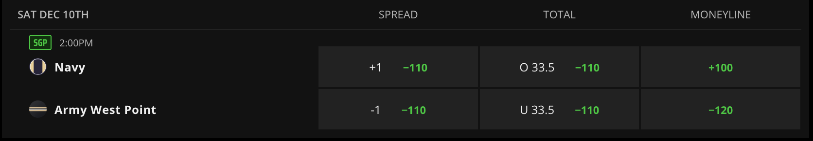
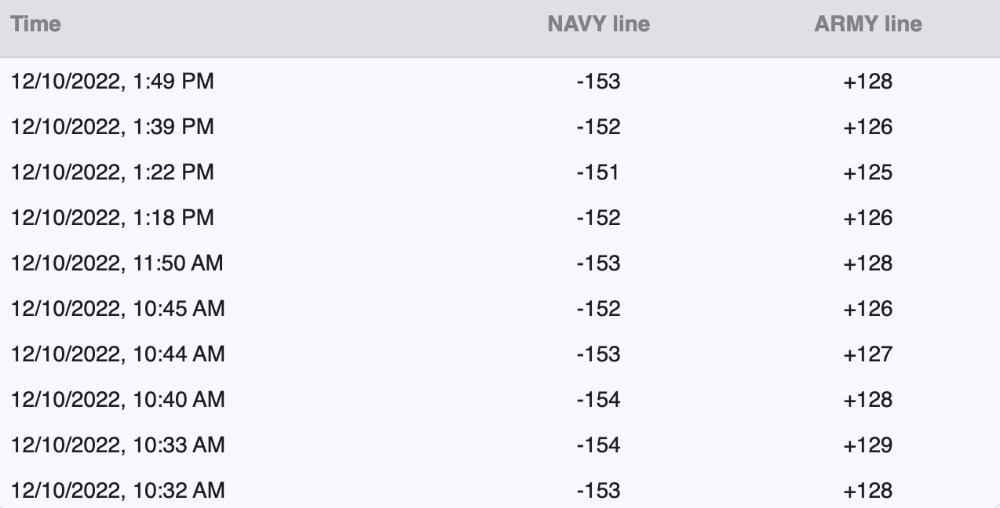
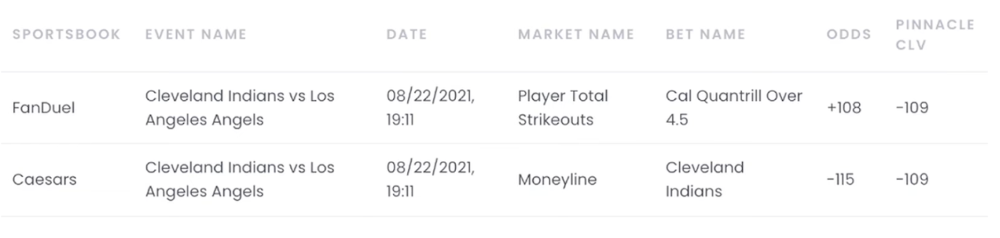

```{r setup, include=FALSE}
knitr::opts_chunk$set(echo = TRUE, warning = FALSE)
library(dplyr)
library(tidymodels)
library(tidyverse)
library(glmnet)
library(probably)
library(ggplot2)
library(sf)
library(maps)
library(plotly)
library(remotes)
library(kableExtra)
```

## Introduction

For this project, we wanted to investigate ways in which someone could over time receive positive return from sports gambling, particularly in a way where we remove the biases of having sports knowledge and focusing solely on leveraging expected value. What originally began as a dead end project that just examined trends in college football gambling results was turned into something much more applicable when we met with an expert in the field named Alex Monahan, the co-founder of [OddsJam.com](oddsjam.com) which is a site that compiles game lines for all sports, and most importantly all books, to allow for arbitrage gambling where a person can select a line from the book with the best value possible, resulting in positive expected value over time. In addition to comparing between books, Monahan also used the movement of lines of a particular game as a way to track his success, checking the line he placed his bet on against what the closing line was at game time to see if his bet had a better value than at closing. Across his site Monahan has posted his own success from using his arbitrage strategies, posting earnings of $400,000, a value so good that we wanted to investigate his process. This paper will further discuss why lines move and how this impacts expected value gambling, along with creating predictive models for the five major U.S. sports, NFL, NCAA Football, MLB, NBA, and NHL which are devised to help a gambler decide which money lines are most likely to be more valuable than what they will close at.

## What is Sports Betting?

If a game is being played, people are going to bet on it. Humans have been gambling on sports since ancient times, but recent legislation in the United States has allowed sports betting to become legal in 30 states, with many other states in heated debates over legalizing it themselves as seen in the graphic below displaying which states have legalized sports betting through various platforms. Over $57.2 billion dollars were bet on U.S. licensed sports books in 2021, and that does not take into account offshore websites used by those living in states where sports betting is not yet legal or underage gamblers. 

```{r eval=FALSE, message=FALSE, include=FALSE}
library(albersusa)

us <- usa_composite()
us_map <- fortify(us, region="name")

legality = read.csv("legality_by_state.csv")
legality = legality %>%
  mutate(id = State,
         In.Person = ifelse(as.logical(Online) & as.logical(In.Person), 0, In.Person),
         not_legal = if_else(Online == 0 & In.Person == 0 & Pending == 0, 1, 0),
         ID = tolower(State),
         status = (Online + 2 * In.Person + 3 * Pending + 4 * not_legal),
         `Legal Status` = cut(status, breaks = c(0,1,2,3,4), labels = c("Online", "In Person Only", "Pending", "Not Legal")))


us_map = left_join(us_map, legality, by = "id")

us_map_betting = ggplot() +
  geom_map(data=us_map, map=us_map,
           aes(x=long, y=lat, map_id=id, fill = `Legal Status`),
           color = "white") + 
  ggthemes::theme_map() + 
  labs(title = "Sports Betting Legality By State")
  

save(us_map_betting, file = "Narrative_Graphics/us_map_betting")
```

```{r message=FALSE, echo=FALSE}
load("Narrative_Graphics/us_map_betting")
plot(us_map_betting)
```

As sports gambling becomes more prominent, data analysis and modeling has become a huge area of study as people try to make gambling profitable. All over social media, people who have developed models that have shown success (these people are known as "sharps"), look to sell their picks to the public bettors, claiming that even with the cost of their picks, users will still win enough to be profitable. Unfortunately, many of these sellers only claimed their sharp status with early luck off of a small sample size on their models and at the end of the day, when solely trying to predict winners and losers of a game the Vegas models tend to come out on top.

```{r eval=FALSE, message=FALSE, include=FALSE}
load("basic_betting_data/nba_raw.rdata")
nba_raw <- betting_df

nba_times = nba_raw %>% 
  select(c(id, start_time)) %>% 
  unique()
nba_times = nba_times %>% unique()
rm(nba_raw)

load("basic_betting_data/nhl_raw.rdata")
nhl_raw <- betting_df

nhl_times = nhl_raw %>%
  select(c(id, start_time)) %>%
  unique()
rm(nhl_raw)

load("basic_betting_data/nfl_raw.rdata")
nfl_raw <- betting_df

nfl_times = nfl_raw %>%
  select(c(id, start_time)) %>%
  unique()
rm(nfl_raw)

load("basic_betting_data/mlb_raw.rdata")
mlb_raw <- betting_df

mlb_times = mlb_raw %>%
  select(c(id, start_time)) %>%
  unique()
rm(mlb_raw)

load("basic_betting_data/ncaaf_raw.rdata")
ncaaf_raw <- betting_df

ncaaf_times = ncaaf_raw %>%
  select(c(id, start_time)) %>%
  unique()
rm(ncaaf_raw)

times = rbind(nhl_times, nba_times,  ncaaf_times, nfl_times, mlb_times)
save(times, file = "basic_betting_data/game_times.rdata")

load("basic_betting_data/nfl_ml_clean.rdata")
load("basic_betting_data/ncaaf_ml_clean.rdata")
load("basic_betting_data/mlb_ml_clean.rdata")
load("basic_betting_data/nba_ml_clean.rdata")
load("basic_betting_data/nhl_ml_clean.rdata")

all_sports_raw = rbind(mlb_ml, nba_ml,  nfl_ml, ncaaf_ml, nhl_ml)

all_sports_reliability_plot = all_sports_raw %>%
  group_by(league) %>%
  mutate(bins = cut_number(home_prob_fair, 5)) %>%
  ungroup() %>%
  group_by(league, bins) %>%
  summarise(x = mean(home_prob_fair), 
            y = mean(home_team_win)) %>%
  ggplot(aes(x=x, y=y, color=league)) +
  geom_abline(slope = 1, color = "black", lty = 2) +
  geom_point() +
  geom_line() +
  facet_wrap(~league) +
  theme_bw() +
  labs(title = "Predicted Home Win Probability Vs. True Win Probability", x = "Predicted Win Probability", y = "True Home Win Probability")

save(all_sports_reliability_plot, file = "Narrative_Graphics/all_sports_reliability_plot")

rm(nba_raw, nhl_raw, nfl_raw, mlb_raw, ncaaf_raw, all_sports_raw)
```

```{r message=FALSE, echo=FALSE}
load("Narrative_Graphics/all_sports_reliability_plot")
plot(all_sports_reliability_plot)
```

The graphic above displays a reliability plot for the last 5 full seasons of the MLB, NBA, NCAA Football, NFL, and NHL. The plots display the cumulative frequency of true wins on the y-axis, and the average predicted win probabilities on the x-axis. Reliability plots indicate how well calibrated predictions made by a model are. The reliability plot of a perfectly calibrated model, meaning a prediction with probability $p$ is correct $p * 100$ percent of the time, will be linear with slope equal to 1. Each plot is almost a straight line, with slight variations, which indicates how incredible sports books are at predicting the outcomes.

Most gamblers bet for fun. These are known as "square bettors". They make up the overwhelming majority of bettors and view gambling as a form of entertainment. Most "squares" do not expect to be making money in the long run, and accept the fact that "the house always wins." On the other hand, the "sharp bettors" are the ones trying to create models to surpass the success rates noticed above. This however, is incredibly difficult and requires a deeply advanced understanding of statistics. Because of the amount of money being gambled daily, books employ incredibly intelligent statisticians to create the prediction models. To beat the books in this way requires beating a team of highly paid, educated, and intelligent data scientists which is impractical.

However, there are other ways that people claim can be profitable in the long run, which we will explore in this project. But before we get any deeper into our analysis, we should go over how sports betting actually works and introduce some common terminology.

## How Sports Betting Works

Sports books offer many different ways to bet on sports, including bets on team outcomes, player stats, and even live bets which are updated lines that are produced as a game is being played. Typically the most common types of bets are the team outcome bets which include straight bets, money line bets, and over/under bets. Straight bets refer to betting on a team to win or lose by a certain amount of points, known as the spread. A moneyline bet means the gambler picks a team to win straight up. An over/under bet is when a bettor gambles on the combined score being above or below a certain number. Over/under bets can also be applied to a singular team in the game, predicting how many points that team alone will score. For each of these bets, the book sets a probability in the form of a line. In the United States the probabilities are displayed through American odds, which come in the form of a number (known as a line) greater than or equal to 100, or less than or equal to -100. Positive values indicate that if a bettor bets $100, they will win the amount of the line plus their original bet. Negative values mean that a bettor has to bet the size of the line to win \$100 plus their original bet. 

<center>


</center>

Take this image, for example. It is a screen shot of an offering from one of the most used books in the U.S., DraftKings.com. It is for a college football game taking place on Saturday, December 10, 2022 between Navy and Army. The money line column is the easiest to understand. A $100 bet on Navy to win at +100 American odds would return \$100 in winnings plus the original \$100 bet, so \$200 in total. A \$120 bet on Army to win at -120 American odds would also win \$100, and return the original bet for a total of \$220. 

After understanding how American odds work, the other two columns are pretty straightforward. When betting on the spread, a positive value means that a bet on that team will push (get just the bet back) if the team loses by the spread and win if the team loses by less than the spread. Conversely, a negative value means that a team has to win by more than the spread to win the bet. DraftKings thinks that Army is a 1 point favorite and is offering a line of -110. This means a bet of $110 would win \$100 if Army wins by more than 1. If they win by 1, the original bet will be returned. Similarly, a bet on the total over (indicated by O 33.5 in the picture) means the bettor will win if the sum of the points scored by both teams is 34 or more (the .5 means that the bet cannot push), and a bet on the under means the bettor will win if the sum of the points is 33 or less. In addition, while not included in this image, there is often an option to bet on the total over for a specific team in the game, which is the same idea as the total in the graphic only it would rely only on the individual score of Army or Navy.

In football, the spread and the over / under bets are usually regarded as a 50 / 50 bet, however books usually price coinflips at -110 on each side. A line of -110 has an implied probability of 52.38% ($\frac{110}{110 + 100} * 100$), even though the true probability, also known as the "fair" probability should be .5 on each side ($\frac{.5238}{.5238 + .5238} * 100$) This means the sum of the two probabilities of the possible outcomes is 104.76%. The extra 4.76% is known as the "juice" or the "vig", and it is how the books make their profit. If Bettor A places a $110 bet on Navy at +1 and Bettor B places \$110 on Army -1, and Army wins by more than 1, DraftKings will pay \$100 to Bettor B, but collect \$110 from Bettor A, leaving the book with a \$10, or 4.76%, profit. This motivates DraftKings to try to keep equal dollar amounts of bets on each side, meaning that the company will change the spread or the line if there is an imbalance. 

### Implied and Fair Probability Formulas

Implied Probability : $\frac{-1 * \text{Negative American Odds}}{\text{-1 * Negatvie American Odds + 100}}$ or $\frac{100}{\text{ Positive American Odds + 100}}$

Fair Probability : $\text{Fair Probability}_1 =\frac{\text{implied probability}_1}{\text{implied probability}_1 + \text{implied probability}_2}$

## Moving Lines

Due to the "vig" previously discussed, the goal of any book is for at game time to have the distribution of bets from the public be equal on each side. When successful at this, books ensure that they will receive a 4.76% profit on the sum of all bets placed, allowing them to profit regardless of the actual result. Particularly in sports like football where game lines are posted a week in advance, this allows for a lot of time for variation.

<center>


</center>

Using the Army Navy game again as an example, we can notice how frequently the lines change. In the span of roughly three hours, the line was updated ten times, and while this short window shows very small variation in the lines, over the course of a week this can lead to opportunities for large differences in line values.

This variation leads to possible opportunity of maximizing line value if you can predict the direction a line will move.

## Using Closing Line Value as a Tool

Eventually, a game has to begin and the pre-game lines will no longer change, remaining at a final value known as the closing line value. In our meeting with Monahan, he mentioned his way of retroactively checking whether or not he made a successful bet as whether or not the line he bet on has a better value than the closing line.

<center>


</center>

The image above is an example of the log Monahan keeps to track his success rate on his bets. In this, he uses the closing line for Pinnacle as his baseline bet, regardless of the book he is gambling on under the assumption that Pinnacle is the most accurate book available. The first bet was placed on total strikeouts for pitcher Cal Quantrill at over 4.5 (an example of a bet on individual player's stats called a "prop bet") at a line of +108. At closing, Pinnacle valued this line at -109. This bet would be deemed as a successful bet for Monahan since the value of +108 is significantly better than -109.

On the other hand the second bet was placed through Caesars on the money line of the game at a a value of -115, whereas Pinnacle closed at a better value of -109, deeming this as an unsuccessful bet for Monahan.

## Research Question

In the following analysis, we will attempt to model the movement of line data to predict which money lines in each of the five major U.S. sports are most likely to decrease in value at closing, giving insight into what lines will result in successful bets and allowing someone to use closing line value as a proactive tool for gambling as opposed to the retroactive way Monahan has implemented it.

## Data Set

### Scraping The Data

Our data was scraped from [ActionNetwork's](actionnetwork.com) historical betting database. The company functions similarly to OddsJam, however they are used by gamblers to keep track of their bets. Meaning they are less inclined to keep their data private as they are not selling it to their customers.

We noticed that every time a page on ActionNetwork with betting data was loaded, it would send an HTTP request with the url 
https://api.actionnetwork.com/web/v1/scoreboard/{league}?season={year}&week={week}&bookIds={list of book ids} for NFL and NCAA Football, and https://api.actionnetwork.com/web/v1/{league}?&date={YYYYDDMM}&bookIds={list of book ids} for NCAA Basketball, NBA, NHL, and MLB. This allowed us to easily scrape data using the `httr` and `jsonlite` packages by specifying which week and year for NFL and NCAAF, and the date for the other 3 leagues. The list of book ids was taken from https://api.actionnetwork.com/web/v1/books, which contained all the information about the books available and their corresponding IDs. We were able to get historical betting data across multiple different books from as far back as 2017. 

The code we wrote to scrape the data can be found at [data_scraper.R](). To reproduce our scraped data, run the following code. To get the data without having to scrape the code, you can load the data set `CLV_Analysis/betting_data.rdata`.

```{r, eval=FALSE, echo=TRUE}
source("CLV_Analysis/data_scraper.R")

save_df = function(league) {
  books = "all"
  start_year = 2017
  end_year = 2022
  betting_df = get_betting_data(league, books, start_year, end_year)
  save(betting_df, file = paste("betting_data/", league, "_raw.rdata",sep = ""))
}

leagues = c("ncaaf", "nfl", "mlb", "nba", "nhl")

map(
  leagues,
  save_df
)
```

This was the first step to getting a data set with all of the game ids for all of the games from our sports of interest from the year 2017 through 2022 which was compiled into the data set called. We then cleaned that data into a list of game ids for each sport and used the link https://api.actionnetwork.com/web/v1/games/{gameids}/oddshistory to run another scraping function which gathered the line histories for each game and compiled that into line history data sets for each sport. It should be noted that html errors occurred in the years 2018 and 2020 so lists of those game ids have to be cleaned separately and implemented on their own to pick up a chunk of the line histories from those seasons. 

The code used for this can be found in [line_movement_data.R](). To scrape this data you can replace the capitalized `LEAGUE` parts with the capitalized form of the respective league you want to scrape or the data sets for each sport can be loaded from the directory `CLV_Analysis/LEAGUE_data/LEAGUE_movement_df.rdata`

```{r, eval=FALSE, echo=TRUE}
source("CLV_Analysis/line_movement_data.R")
LEAGUE <- betting_data %>%
  filter(league_name == "LEAGUE") %>%
  filter(season == 2022 | season == 2021 | season == 2019 | season == 2017) %>%
  group_by(id) %>%
  summarise(t = n())

clean_df = function(df, id) {
  
  # select the rows we need
  df = df %>%
    select(id, start_time, away_team_id, home_team_id, ml_away, ml_home, spread_away, spread_home, total,away_total, home_total, league_name )
  
  # remove unnecessary variables in the odds
  df = df %>%
    select(-c(ml_home_public, ml_away_public, spread_home_public, spread_away_public, total_under_public, total_over_public, ml_home_money, ml_away_money, 
              spread_home_money, total_over_money, total_under_money, num_bets, type, inserted, line_status, spread_away_line, spread_home_line))
  
  return(df)
}

LEAGUE_movement_df = NULL

for (id in LEAGUE$id) {
  
  game_id = id
  url = "https://api.actionnetwork.com/web/v1/games/"
  url = paste(url, game_id, "/oddshistory")
  resp = GET(url, user_agent("Mozilla/5.0 (Macintosh; Intel Mac OS X 10_15_7) AppleWebKit/537.36 (KHTML, like Gecko)    Chrome/106.0.0.0 Safari/537.36"))
  resp_df = jsonlite::fromJSON(content(resp, "text"))$odds
  resp_df <- resp_df %>%
    mutate(id = game_id) %>%
    mutate(league = "LEAGUE")
    LEAGUE_movement_df = rbind(LEAGUE_movement_df, resp_df)

  print(paste("finished game",id))
  }
```

### Cleaning the Data For Application

At the next step, we removed any variables that would not be applicable to a user who only has access to the game lines, along with any indexing variables. These were mainly variables that described the public betting distribution on each of the lines including moneyline, spread, and over / under bets. 

In addition, we split each observation into two, one for the home team and one for the away team in order to replicate the fact that both would be options for someone to bet on.

Finally, we implemented a binary variable `make_bet`. This took the closing moneyline value and compared it to the moneyline of each previous input, giving a `Yes` input to observations where money line was greater than the closing money line and a `No` input to those that were less than or equal to the closing line. This gave us the main output variable we will use for our classification predictive modeling for predicting a successful bet.

The code used for this can be found in [line_movement_compiled.R](). To clean the data yourself you can implement the following code, once again replacing the capitalized LEAGUE with the capitalized form of the league name of interest. You can also load the already cleaned data set in the directory `CLV_Analysis/LEAGUE_data/LEAGUE_movement_split_df.rdata`

```{r, eval=FALSE, echo=TRUE}
source("CLV_Analysis/line_movement_compiled.R")

LEAGUE_movement_df <- LEAGUE_movement_df %>%
  mutate(inserted = gsub("T"," ", inserted)) %>%
  mutate(inserted = gsub("Z","", inserted)) %>%
  mutate(inserted = strptime(inserted, format = "%Y-%m-%d %H:%M:%S")) %>%
  select(-spread_away_line, -spread_home_line, -over, -under, -draw, -away_over, -away_under, -home_over, -home_under, -type)

LEAGUE_movement_df <- cbind(Index = 1:nrow(LEAGUE_movement_df), LEAGUE_movement_df)  

LEAGUE_final_line <- LEAGUE_movement_df %>%
  group_by(id, book_id) %>%
  slice(which.max(as.POSIXct(inserted)))

LEAGUE_previous_lines <- LEAGUE_movement_df %>%
  anti_join(NFL_final_line, by = "Index")

LEAGUE_final_line <- LEAGUE_final_line %>%
  select(ml_away, ml_home, id, book_id)

colnames(LEAGUE_final_line)[1] <- "away_Final_Line"
colnames(LEAGUE_final_line)[2] <- "home_Final_Line"

LEAGUE_previous_lines <- LEAGUE_previous_lines %>%
  group_by(id, book_id) %>%
  left_join(LEAGUE_final_line, by =  c("id", "book_id" )) %>%
  ungroup() 

LEAGUE_previous_lines %>%
  group_by(book_id) %>%
  summarise(t = n() )

away_LEAGUE <- LEAGUE_previous_lines %>%
  select(-ml_home, -spread_home, -home_total, -ml_home_public, -spread_home_public, -home_Final_Line)

colnames(away_LEAGUE)[2] <- "money_line"
colnames(away_LEAGUE)[3] <- "spread"
colnames(away_LEAGUE)[5] <- "team_total"
colnames(away_LEAGUE)[6] <- "public_ml"
colnames(away_LEAGUE)[7] <- "public_spread"
colnames(away_LEAGUE)[8] <- "public_team_under"
colnames(away_LEAGUE)[9] <- "public_team_over"
colnames(away_LEAGUE)[14] <- "Final_line"

away_LEAGUE <- away_LEAGUE %>%
  mutate(Location = "away")

home_LEAGUE <- LEAGUE_previous_lines %>%
  select(-ml_away, -spread_away, -away_total, -ml_away_public, -spread_away_public, -away_Final_Line)

colnames(home_NFL)[2] <- "money_line"
colnames(home_NFL)[3] <- "spread"
colnames(home_NFL)[5] <- "team_total"
colnames(home_NFL)[6] <- "public_ml"
colnames(home_NFL)[7] <- "public_spread"
colnames(home_NFL)[8] <- "public_team_under"
colnames(home_NFL)[9] <- "public_team_over"
colnames(home_NFL)[14] <- "Final_line"

home_LEAGUE <- home_LEAGUE %>%
  mutate(Location = "home")

LEAGUE_lines_split <- away_LEAGUE %>%
  rbind(home_LEAGUE) %>%
  mutate("make_bet" = ifelse(money_line>Final_line, "Yes", "No"))
```

### Cleaning the Data for Leaks

At first, it seemed as if this was going to be a viable data set to be implemented for modeling, but on first attempt leaks in the data were obvious. Results were giving accuracy measures of up to 96% on the majority of our models, and while it would be great for profit if this were possible, it was apparent that issues in the data were causing this unreasonable success. We pinpointed the first issue to be that keeping each change of the line data in the data set made it too easy for the models to just track the movement of the line based on the previous input and make a much more accurate prediction of its direction, something that would not be applicable to a gambler who does not have access to the previous line values. To remedy this, we randomly sampled one of the previous line observations from each game so that the models could not trace through the full movement of that line. 

The next leak was being caused by trying to make a model that did not distinguish between home and away teams. Since all of the lines are symmetric between home and away teams, and if say the home line was increasing in value then the away line would be decreasing, the models could pick up that if a certain line was saying yes to placing the bet, there was another line that was the opposite of that in the data set that would be a no bet. To fix this we had to split the data again into two data sets, one for home teams and one for away teams and run separate models on each.

This cleaning was run at the front end of all of the final modeling files which can be found in the directory `CLV_Analysis/LEAGUE_CLV_Analysis.Rmd`. To run this cleaning yourself you can implement the following code with the same replacement techniques as before.

```{r, eval=FALSE, echo=TRUE}
# Home Data set
LEAGUE_Sample <- LEAGUE_lines_split %>%
  select(-Index, -Final_line, -inserted, -public_ml, -public_spread, -public_team_under, -public_team_over) %>%
  na.omit() %>%
  group_by(id, book_id, Location) %>%
  sample_n(1)

LEAGUE_Home <- LEAGUE_Sample %>%
  filter(Location == 'home')

LEAGUE_Home = subset(LEAGUE_Home, select = -c(id,book_id, league, Location) )

# Away Data Set
LEAGUE_Sample <- LEAGUE_lines_split %>%
  select(-Index, -Final_line, -inserted, -public_ml, -public_spread, -public_team_under, -public_team_over) %>%
  na.omit() %>%
  group_by(id, book_id, Location) %>%
  sample_n(1)

LEAGUE_Away <- LEAGUE_Sample %>%
  filter(Location == 'away')

LEAGUE_Away = subset(LEAGUE_Away, select = -c(id,book_id, league, Location) )
```

A major point to note of this process is that through cleaning the data for leaks, we unfortunately lost the vast majority of data we compiled. Since all data from before 2017 was missing the team over/under lines, we were stuck with only data from 2017-2022 with many missing games within those due to other missing variables. This resulted in the small sample sizes noted in the table below and therefore leads to skepticism in the models produced.

```{r, echo = FALSE}
`League` <- c("NFL", "NCAAF", "NBA", "MLB", "NHL")
`Away Sample Size` <- c(943, 574, 1739, 6504, 2793)
`Home Sample Size` <- c(941,582, 1761, 6511, 2749)

Samples <- data.frame(`League`, `Away Sample Size`, `Home Sample Size`)

Samples %>%
  kbl(caption = "Home and Away Sample Sizes for Each League", col.names = c("League","Away Sample Size","Home Sample Size")) %>%
  kable_classic_2()
```

## Failed Models

Once the data was finally ready, we were able to start modeling. Unfortunately, the process was not always perfect. For both the home and away data sets for each league we ran three different classification techniques, logistic modeling, random forests, and decision trees. For every data set we got the similar results with the logistic and random forest models failing and having the most success with our decision tree models. 

To quickly give insight on why the logistic and random forest models were deemed failures, this section will run through the modeling process for the home NFL data. To see the results for the rest of the models the files can be found in the directory `CLV_Analysis/LEAGUE_CLV_Analysis.Rmd`.

### Logistic Models

The first model we produced was a logistic model, which applies a coefficient to each variable that represents how an increase in one unit of each variable affects the probability that that observation will be one that you should bet on.

```{r include=FALSE}
library(vip)
library(probably) #install.packages('probably')
tidymodels_prefer()
conflicted::conflict_prefer("vi", "vip")
library(rpart.plot)

set.seed(121)

load("NFL_Data/NFL_movement_split_df.rdata")
```

```{r include=FALSE}
NFL_Sample <- NFL_lines_split %>%
  select(-Index, -Final_line, -inserted, -public_ml, -public_spread, -public_team_under, -public_team_over) %>%
  na.omit() %>%
  group_by(id, book_id, Location) %>%
  sample_n(1)

NFL_Home <- NFL_Sample %>%
  filter(Location == 'home')

NFL_Home = subset(NFL_Home, select = -c(id,book_id, league, Location) )

```

#### Logistic Model Coefficients

When setting the model, creating the best model possible was the goal in this case, and with already only four variables being implemented it was important to use all of them to get the best results. After setting the model to our data we ended up with the following coefficients for our variables.

```{r echo=FALSE}
# Make sure you set reference level (the outcome you are NOT interested in)
NFL_Home <- NFL_Home %>%
  mutate(outcome = relevel(factor(make_bet), ref='No')) #set reference level

NFL_cv10 <- vfold_cv(NFL_Home, v = 10)

# Logistic Regression Model Spec
logistic_spec <- logistic_reg() %>%
    set_engine('glm') %>%
    set_mode('classification')

# Recipe
logistic_rec <- recipe(make_bet ~ money_line + spread + total + team_total, data = NFL_Home, family = binomial('logit'), maxit = 100) %>%
    step_normalize(all_numeric_predictors()) %>% 
    step_dummy(all_nominal_predictors())

# Workflow (Recipe + Model)
log_wf <- workflow() %>% 
    add_recipe(logistic_rec) %>%
    add_model(logistic_spec) 

# Fit Model to Training Data
log_fit <- fit(log_wf, data = NFL_Home)
```

```{r echo = FALSE}
# Get Exponentiated coefficients + CI
log_fit %>% tidy() %>%
  mutate(OR.conf.low = exp(estimate - 1.96*std.error), OR.conf.high = exp(estimate + 1.96*std.error)) %>% # do this first
  mutate(OR = exp(estimate)) %>%
  kbl(caption = "Logistic Model Coefficients") %>%
  kable_classic(full_width = F, html_font = "Cambria")
```
This table does give some insight on the affect of these variables. We notice that as money line and total increase, it becomes more likely that you should place the bet as seen by the positive coefficients, while as spread and team totals increase the model is less likely to suggest betting.

#### Logistic Model Results

After setting the model, we then ran a ten cross validation folds test on the model to mimic how this model would work against outside data. This is where we noticed the failure in this model as seen in the test statistics below.

```{r echo = FALSE}
# CV Fit Model
log_cv_fit <- fit_resamples(
    log_wf, 
    resamples = NFL_cv10,
    metrics = metric_set(sens, yardstick::spec, accuracy, roc_auc),
    control = control_resamples(save_pred = TRUE, event_level = 'second'))  # you need predictions for ROC calculations

collect_metrics(log_cv_fit) %>% #default threshold is 0.5
  kbl(caption = "Logistic Model Metric CV Fold Test Results") %>%
  kable_classic(full_width = F, html_font = "Cambria")
```

While the accuracy of this model actually shows promise at 64%, this is heavily weighted by the specificity of 97% which is the amount of times the model correctly predicts not to place a bet. In the case of sports betting, the most important statistic is sensitivity or the percentage of bets that should be placed that are correct. This is because sensitivity represents the cases where money is actually being risked by the better. In the case of specificity, the model incorrectly predicting not to bet is not that important since the better has not actually lost anything, but each incorrect bet placed costs money. Since this model shows a very poor sensitivity of about 0.04, this model was deemed a failure.

### Random Forest

The next models we ran were random forest models which randomly groups the data into thousands of data sets to mimic the idea of outside data and creates decision trees for each, averaging them to into one predictive model. This method gave similar results to the logistic model.

```{r echo = FALSE}
# Model Specification
rf_spec <- rand_forest() %>%
  set_engine(engine = 'ranger') %>% 
  set_args(mtry = NULL, # size of random subset of variables; default is floor(sqrt(number of total predictors))
           trees = 1000, # Number of trees
           min_n = 2,
           probability = FALSE, # FALSE: get hard predictions (not needed for regression)
           importance = 'impurity') %>% # we'll come back to this at the end
  set_mode('classification') # change this for regression

# Recipe
data_rec <- recipe(make_bet ~ spread + total + team_total + money_line, data = NFL_Home)

# Workflows
data_wf_mtry2 <- workflow() %>%
  add_model(rf_spec %>% set_args(mtry = 2)) %>%
  add_recipe(data_rec)

data_wf_mtry4 <- workflow() %>%
  add_model(rf_spec %>% set_args(mtry = 4)) %>%
  add_recipe(data_rec)
```

#### Random Forest Variable Importance

```{r include=FALSE}
set.seed(121) 
data_fit_mtry4 <- fit(data_wf_mtry4, data = NFL_Home)

rf_OOB_output <- function(fit_model, model_label, truth){
    tibble(
          .pred_class = fit_model %>% extract_fit_engine() %>% pluck('predictions'), #OOB predictions
          make_bet = truth,
          label = model_label
      )
}

rf_OOB_output(data_fit_mtry4,4, NFL_Home %>% pull(make_bet))
```

Once again, we elected to go with the model that gave us the best chance at maximizing sensitivity and used all the variables at our disposal. This random forest model gave us the following variable importance measures

```{r echo = FALSE}
model_output <-data_fit_mtry4 %>% 
    extract_fit_engine() 

model_output %>% 
    vip(num_features = 30) + theme_classic() #based on impurity
```

Unsurprisingly from this model, we notice that movements in moneyline tend to have the most impact on the probability of predicting that a bet should be placed on a certain line, followed by the game total, then team total, and lastly the spread having the least effect.

#### Random Forest Results

Unfortunately, when we ran the test statistics of the model we got similar results to the logistic model as seen in the confusion matrix for our random forest below.

```{r echo = FALSE}
mtry4Conf <- rf_OOB_output(data_fit_mtry4,4, NFL_Home %>% pull(make_bet)) %>%
    conf_mat(truth = make_bet, estimate= .pred_class)
mtry4Conf <- as.data.frame.matrix(mtry4Conf$table)

mtry4Conf %>%
    kbl(caption = "Random Forest Model Confusion Matrix") %>%
    kable_classic(full_width = F, html_font = "Cambria")
```

Once again, while this model does a good job at predicting when not to bet, with a specificity of about 73%, this model still fails where it counts with a sensitivity of only 32%. Just like the logistic model this is far to low to ever risk money on.

## Final Models

After producing the logistic and random forest models for each sport and deeming them as failures, we continued fitting one more model to each data set, this time using decision trees. Decision trees are able to split quantitative variables into many binary inequalities at the values it finds to be the most influential on the probability of a particular line being a successful bet. You can then trace through the tree using the line values to the bottom where it tells you whether or not to bet on the game along with giving a probability for how confident the tree is in that outcome. 

This next section takes you through the model fitting and evaluating process of the NFL home and away data sets along with guiding you through how to interpret the outputs. In addition, the analyses for the other fours sports have been included in the document and to access them just click on the bar beneath the league name. 

### NFL

#### Home Team Decision Tree

```{r echo=FALSE}
ct_spec <- decision_tree() %>%
  set_engine(engine = 'rpart') %>%
  set_args(cost_complexity = 0.0044,  #default is 0.01 (used for pruning a tree)
           min_n = NULL, #min number of observations to try split: default is 20 [I think the documentation has a typo and says 2]  (used to stop early)
           tree_depth = NULL) %>% #max depth, number of branches/splits to get to any final group: default is 30 (used to stop early)
  set_mode('classification') # change this for regression tree


data_rec <- recipe(make_bet ~ money_line + spread + total + team_total , data = NFL_Home)

data_wf <- workflow() %>%
  add_model(ct_spec) %>%
  add_recipe(data_rec)

fit_mod <- data_wf %>% # or use tune_grid() to tune any of the parameters above
  fit(data = NFL_Home)

# Plot the tree (make sure to load the rpart.plot package first)
fit_mod %>%
  extract_fit_engine() %>%
  rpart.plot()

```

The visualization above is the final model output for betting on a home team in the NFL. You can imagine this like a plinko board, where you take your line and at each split, which are called nodes, you can check the value of that variable in the line and based on whether the value is greater than or less than the one displayed in the tree, you can follow the path it leads. The "Yes" or "No" values in each node represents if you stopped tracing the line at that point what decision the model makes on making the bet or not. For example at the root node, which is the first and most impactful split in the tree, we would check if the over/under total for the game is greater than or less than 38. If it is less than 38, the decision has already made its decision, dropping all the way to the bottom and deciding on not making the bet, saying that only 4% of the time it will be a successful bet. On the other hand if the total is greater than 38 we would move on to the next node which checks if money line is greater than or less than 321.

```{r echo = FALSE}
fit_mod %>%
  extract_fit_engine() %>%
  pluck('variable.importance') %>%
  kbl(caption = "Home NFL Variable Importance", col.names = c("Variable Importance")) %>%
  kable_classic(full_width = F, html_font = "Cambria")
```

We can also extract the following variable importance metrics from the decision tree, which calculates the overall impact of each variable on the predictive ability of the model, taking into account both how many times the variable appears in the tree and how high up on the tree the binary splits for that variable lie. From this we see money line and game totals having the most impact on the final prediction, followed by spread and then the individual team total being the least important measure.

#### Home Team Decision Tree Statistics

```{r, echo=FALSE}
# Hard (class) prediction
prediction <- predict(fit_mod, new_data = NFL_Home, type = "class")

table_mat <- table(NFL_Home$make_bet, prediction$.pred_class)

accuracy_Test <- sum(diag(table_mat)) / sum(table_mat)
sens_Test <- table_mat[2,2] / (table_mat[1,2] + table_mat[2,2])
spec_Test <- table_mat[1,1] / (table_mat[1,1] + table_mat[2,1])

`Measurement` <- c("Accuracy", "Sensitivity", "Specificity")
`Value` <- c(0.7247609, 0.6742081, 0.7402778)


Stats <- data.frame(`Measurement`, `Value`)

Stats %>%
  kbl(caption = "Home NFL Decision Tree Accuracy Statistics", col.names = c("Accuracy Measure","Value")) %>%
  kable_classic_2()
```

As we can see, this model significantly outperforms both the logistic and random forest models, by correctly picking the games to bet on more than 67% of the time when betting on a home team in the NFL, a level of success that would make a bettor very confident in using the model if the sample size of the data set were greater.

#### Away Team Decision Tree

```{r echo=FALSE}
NFL_Sample <- NFL_lines_split %>%
  select(-Index, -Final_line, -inserted, -public_ml, -public_spread, -public_team_under, -public_team_over) %>%
  na.omit() %>%
  group_by(id, book_id, Location) %>%
  sample_n(1)

NFL_Away <- NFL_Sample %>%
  filter(Location == 'away')

NFL_Away = subset(NFL_Away, select = -c(id,book_id, league, Location) )

ct_spec <- decision_tree() %>%
  set_engine(engine = 'rpart') %>%
  set_args(cost_complexity = 0.0022,  #default is 0.01 (used for pruning a tree)
           min_n = NULL, #min number of observations to try split: default is 20 [I think the documentation has a typo and says 2]  (used to stop early)
           tree_depth = NULL) %>% #max depth, number of branches/splits to get to any final group: default is 30 (used to stop early)
  set_mode('classification') # change this for regression tree


data_rec <- recipe(make_bet ~ money_line + spread + total + team_total , data = NFL_Away)

data_wf <- workflow() %>%
  add_model(ct_spec) %>%
  add_recipe(data_rec)

fit_mod <- data_wf %>% # or use tune_grid() to tune any of the parameters above
  fit(data = NFL_Away)

# Plot the tree (make sure to load the rpart.plot package first)
fit_mod %>%
  extract_fit_engine() %>%
  rpart.plot()
```

The tree above represents the decision tree for betting on an away team in the NFL. The most important difference between this tree and the home team model is the simplicity of this model. There are significantly less nodes in this tree, which makes it much easier for a gambler to manually trace their line through to the final decision at the base.

```{r echo = FALSE}
fit_mod %>%
  extract_fit_engine() %>%
  pluck('variable.importance') %>%
  kbl(caption = "Away NFL Variable Importance", col.names = c("Variable Importance")) %>%
  kable_classic(full_width = F, html_font = "Cambria")
```

It is also interesting to note that the above variable importance is not the same for away teams as home teams. While money line remains the most important variable in this model, the game total which was the second most important variable in the home model has dropped to the least important variable in this one, moving spread up into the second most important variable and team total being third.

#### Away Team Decision Tree Statistics

```{r, echo=FALSE}
# Hard (class) prediction
prediction <- predict(fit_mod, new_data = NFL_Away, type = "class")

table_mat <- table(NFL_Away$make_bet, prediction$.pred_class)

accuracy_Test <- sum(diag(table_mat)) / sum(table_mat)
sens_Test <- table_mat[2,2] / (table_mat[1,2] + table_mat[2,2])
spec_Test <- table_mat[1,1] / (table_mat[1,1] + table_mat[2,1])

`Measurement` <- c("Accuracy", "Sensitivity", "Specificity")
`Value` <- c(0.6924708, 0.6455026, 0.704244)


Stats <- data.frame(`Measurement`, `Value`)

Stats %>%
  kbl(caption = "Away NFL Decision Tree Accuracy Statistics", col.names = c("Accuracy Measure","Value")) %>%
  kable_classic_2()
```

The increased simplicity of this model did however slightly decrease the success rate of this model, but still with a sensitivity of over 64% this model still performs very well and I would be confident in using this model for future bets if not for the small sample size.

### NCAA Football

<details>
  <summary>Click for NCAA Football Analysis</summary>

#### Home Team Decision Tree

```{r include=FALSE}
load("NCAAF_Data/NCAAF_movement_split_df.rdata")

NCAAF_Sample <- NCAAF_lines_split %>%
  select(-Index, -Final_line, -inserted, -public_ml, -public_spread, -public_team_under, -public_team_over) %>%
  na.omit() %>%
  group_by(id, book_id, Location) %>%
  sample_n(1)

NCAAF_Home <- NCAAF_Sample %>%
  filter(Location == 'home')

NCAAF_Home = subset(NCAAF_Home, select = -c(id,book_id, league, Location) )
```

```{r, echo=FALSE}
ct_spec <- decision_tree() %>%
  set_engine(engine = 'rpart') %>%
  set_args(cost_complexity = 0.01,  #default is 0.01 (used for pruning a tree)
           min_n = NULL, #min number of observations to try split: default is 20 [I think the documentation has a typo and says 2]  (used to stop early)
           tree_depth = NULL) %>% #max depth, number of branches/splits to get to any final group: default is 30 (used to stop early)
  set_mode('classification') # change this for regression tree


data_rec <- recipe(make_bet ~ money_line + spread + total + team_total , data = NCAAF_Home)

data_wf <- workflow() %>%
  add_model(ct_spec) %>%
  add_recipe(data_rec)

fit_mod <- data_wf %>% # or use tune_grid() to tune any of the parameters above
  fit(data = NCAAF_Home)

# Plot the tree (make sure to load the rpart.plot package first)
fit_mod %>%
  extract_fit_engine() %>%
  rpart.plot()
```

Above is the decision tree for betting on a home team in college football. This tree is much simpler than both of the NFL models and overall turned out to be the simplest model produced. This is mainly due to college footbal having by far the smallest sample size of any of the data sets we used though.

```{r echo=FALSE}
fit_mod %>%
  extract_fit_engine() %>%
  pluck('variable.importance') %>%
  kbl(caption = "Home NCAA Football Variable Importance", col.names = c("Variable Importance")) %>%
  kable_classic(full_width = F, html_font = "Cambria")
```

The variable importance measures here are very similar to that of the away NFL model, but one important note is the extreme lack of importance of game totals in this model making its betting decision.

#### Home Team Decision Tree Statistics

```{r, echo=FALSE}
# Hard (class) prediction
prediction <- predict(fit_mod, new_data = NCAAF_Home, type = "class")

table_mat <- table(NCAAF_Home$make_bet, prediction$.pred_class)

accuracy_Test <- sum(diag(table_mat)) / sum(table_mat)
sens_Test <- table_mat[2,2] / (table_mat[1,2] + table_mat[2,2])
spec_Test <- table_mat[1,1] / (table_mat[1,1] + table_mat[2,1])

`Measurement` <- c("Accuracy", "Sensitivity", "Specificity")
`Value` <- c(0.7130584, 0.6235294, 0.75)


Stats <- data.frame(`Measurement`, `Value`)

Stats %>%
  kbl(caption = "Home NCAA Football Decision Tree Accuracy Statistics", col.names = c("Accuracy Measure","Value")) %>%
  kable_classic_2()
```

Once again, with a sensitivity of more than 62% this model performs very well and if not for the small sample size this would be a good model to use in the future.

#### Away Team Decision Tree

```{r include=FALSE}
load("NCAAF_Data/NCAAF_movement_split_df.rdata")

NCAAF_Sample <- NCAAF_lines_split %>%
  select(-Index, -Final_line, -inserted, -public_ml, -public_spread, -public_team_under, -public_team_over) %>%
  na.omit() %>%
  group_by(id, book_id, Location) %>%
  sample_n(1)

NCAAF_Away <- NCAAF_Sample %>%
  filter(Location == 'away')

NCAAF_Away = subset(NCAAF_Away, select = -c(id,book_id, league, Location) )
```

```{r, echo=FALSE}
ct_spec <- decision_tree() %>%
  set_engine(engine = 'rpart') %>%
  set_args(cost_complexity = 0.01,  #default is 0.01 (used for pruning a tree)
           min_n = NULL, #min number of observations to try split: default is 20 [I think the documentation has a typo and says 2]  (used to stop early)
           tree_depth = NULL) %>% #max depth, number of branches/splits to get to any final group: default is 30 (used to stop early)
  set_mode('classification') # change this for regression tree


data_rec <- recipe(make_bet ~ money_line + spread + total + team_total , data = NCAAF_Away)

data_wf <- workflow() %>%
  add_model(ct_spec) %>%
  add_recipe(data_rec)

fit_mod <- data_wf %>% # or use tune_grid() to tune any of the parameters above
  fit(data = NCAAF_Away)

# Plot the tree (make sure to load the rpart.plot package first)
fit_mod %>%
  extract_fit_engine() %>%
  rpart.plot()
```

The away model is slightly more complex than the home model, but still much simpler than either of the NFL models.

```{r echo=FALSE}
fit_mod %>%
  extract_fit_engine() %>%
  pluck('variable.importance') %>%
  kbl(caption = "Away NCAA Football Variable Importance", col.names = c("Variable Importance")) %>%
  kable_classic(full_width = F, html_font = "Cambria")
```

The variable importance measures show a very similar story to the home model, with the only notable difference being that the game totals have a significantly higher impact on the model's decision for away teams than home teams. If not for the small sample size this model seems ready to use for future games.

#### Away Team Decision Tree Statistics

```{r, echo=FALSE}
# Hard (class) prediction
prediction <- predict(fit_mod, new_data = NCAAF_Away, type = "class")

table_mat <- table(NCAAF_Away$make_bet, prediction$.pred_class)

accuracy_Test <- sum(diag(table_mat)) / sum(table_mat)
sens_Test <- table_mat[2,2] / (table_mat[1,2] + table_mat[2,2])
spec_Test <- table_mat[1,1] / (table_mat[1,1] + table_mat[2,1])

`Measurement` <- c("Accuracy", "Sensitivity", "Specificity")
`Value` <- c(0.7160279, 0.7538462, 0.704955)


Stats <- data.frame(`Measurement`, `Value`)

Stats %>%
  kbl(caption = "Away NCAA Football Decision Tree Accuracy Statistics", col.names = c("Accuracy Measure","Value")) %>%
  kable_classic_2()
```

The increased complexity of this model compared to the home model pays off big time, with the highest sensitivity of any models we produced at above 75%. If it were not for the small sample size this would be a great model for a bettor to use.

</details>

### MLB

<details>
  <summary>Click for MLB Analysis</summary>

#### Home Team Decision Tree

```{r include=FALSE}
load("MLB_Data/MLB_movement_split_df.rdata")

MLB_Sample <- MLB_lines_split %>%
  select(-Index, -Final_line, -inserted, -public_ml, -public_spread, -public_team_under, -public_team_over) %>%
  na.omit() %>%
  group_by(id, book_id, Location) %>%
  sample_n(1)

MLB_Home <- MLB_Sample %>%
  filter(Location == 'home')

MLB_Home = subset(MLB_Home, select = -c(id,book_id, league, Location) )
```

```{r, echo=FALSE}
ct_spec <- decision_tree() %>%
  set_engine(engine = 'rpart') %>%
  set_args(cost_complexity = 0.0015,  #default is 0.01 (used for pruning a tree)
           min_n = NULL, #min number of observations to try split: default is 20 [I think the documentation has a typo and says 2]  (used to stop early)
           tree_depth = NULL) %>% #max depth, number of branches/splits to get to any final group: default is 30 (used to stop early)
  set_mode('classification') # change this for regression tree


data_rec <- recipe(make_bet ~ money_line + spread + total + team_total , data = MLB_Home)

data_wf <- workflow() %>%
  add_model(ct_spec) %>%
  add_recipe(data_rec)

fit_mod <- data_wf %>% # or use tune_grid() to tune any of the parameters above
  fit(data = MLB_Home)

# Plot the tree (make sure to load the rpart.plot package first)
fit_mod %>%
  extract_fit_engine() %>%
  rpart.plot()
```

With MLB being having by far the largest sample size, simplifying the model to a usable form took extensive pruning, with this being the simplest form possible without having the model decide not to bet for every game.

```{r echo=FALSE}
fit_mod %>%
  extract_fit_engine() %>%
  pluck('variable.importance') %>%
  kbl(caption = "Home MLB Football Variable Importance", col.names = c("Variable Importance")) %>%
  kable_classic(full_width = F, html_font = "Cambria")
```

The home MLB variable importance measures show great significance for all of the variables in the data set, with money line showing a massive impact in the final decision of the model. Even the least important measure of the individual team total shows a large impact.

#### Home Team Decision Tree Statistics

```{r, echo=FALSE}
# Hard (class) prediction
prediction <- predict(fit_mod, new_data = MLB_Home, type = "class")

table_mat <- table(MLB_Home$make_bet, prediction$.pred_class)

accuracy_Test <- sum(diag(table_mat)) / sum(table_mat)
sens_Test <- table_mat[2,2] / (table_mat[1,2] + table_mat[2,2])
spec_Test <- table_mat[1,1] / (table_mat[1,1] + table_mat[2,1])

`Measurement` <- c("Accuracy", "Sensitivity", "Specificity")
`Value` <- c(0.6090922, 0.5462687, 0.6337698)


Stats <- data.frame(`Measurement`, `Value`)

Stats %>%
  kbl(caption = "Home MLB Decision Tree Accuracy Statistics", col.names = c("Accuracy Measure","Value")) %>%
  kable_classic_2()
```

Unsurprisingly, the home MLB model does not perform nearly as well as the NFL or college football models. This is likely due to the fact that teams play games almost every day in their season, meaning that game lines are only open for a couple days before the game starts, as opposed to a whole week like football. This results in much less movement in lines of MLB games, making it much more difficult for a model to find consistent patterns. While the sensitivity of nearly 55% is good enough to not put this model into the failure group, I would still be cautious about actually using this for future bets.

#### Away Team Decision Tree

```{r include=FALSE}
load("MLB_Data/MLB_movement_split_df.rdata")

MLB_Sample <- MLB_lines_split %>%
  select(-Index, -Final_line, -inserted, -public_ml, -public_spread, -public_team_under, -public_team_over) %>%
  na.omit() %>%
  group_by(id, book_id, Location) %>%
  sample_n(1)

MLB_Away <- MLB_Sample %>%
  filter(Location == 'away')

MLB_Away = subset(MLB_Away, select = -c(id,book_id, league, Location) )
```

```{r, echo=FALSE}
ct_spec <- decision_tree() %>%
  set_engine(engine = 'rpart') %>%
  set_args(cost_complexity = 0.0008,  #default is 0.01 (used for pruning a tree)
           min_n = NULL, #min number of observations to try split: default is 20 [I think the documentation has a typo and says 2]  (used to stop early)
           tree_depth = NULL) %>% #max depth, number of branches/splits to get to any final group: default is 30 (used to stop early)
  set_mode('classification') # change this for regression tree


data_rec <- recipe(make_bet ~ money_line + spread + total + team_total , data = MLB_Away)

data_wf <- workflow() %>%
  add_model(ct_spec) %>%
  add_recipe(data_rec)

fit_mod <- data_wf %>% # or use tune_grid() to tune any of the parameters above
  fit(data = MLB_Away)

# Plot the tree (make sure to load the rpart.plot package first)
fit_mod %>%
  extract_fit_engine() %>%
  rpart.plot()
```

Once again, to get this model into a form simple enough to use, extensive pruning was applied and the tree above ended up being the simplest model possible without it always deciding not to bet.

```{r echo=FALSE}
fit_mod %>%
  extract_fit_engine() %>%
  pluck('variable.importance') %>%
  kbl(caption = "Away MLB Variable Importance", col.names = c("Variable Importance")) %>%
  kable_classic(full_width = F, html_font = "Cambria")
```

For betting on away teams in the MLB, the main difference in variable importance from home teams is proportionally how much more of an effect money line has on the final decision of the model than the rest of the variable.

#### Away Team Decision Tree Statistics

```{r, echo=FALSE}
# Hard (class) prediction
prediction <- predict(fit_mod, new_data = MLB_Away, type = "class")

table_mat <- table(MLB_Away$make_bet, prediction$.pred_class)

accuracy_Test <- sum(diag(table_mat)) / sum(table_mat)
sens_Test <- table_mat[2,2] / (table_mat[1,2] + table_mat[2,2])
spec_Test <- table_mat[1,1] / (table_mat[1,1] + table_mat[2,1])

`Measurement` <- c("Accuracy", "Sensitivity", "Specificity")
`Value` <- c(0.6938088, 0.6529605, 0.6976209)


Stats <- data.frame(`Measurement`, `Value`)

Stats %>%
  kbl(caption = "Away MLB Decision Tree Accuracy Statistics", col.names = c("Accuracy Measure","Value")) %>%
  kable_classic_2()
```

Interestingly, the away team model greatly outperforms the home team model with a sensitivity of almost 65%. This also compares well to the sensitivities for the football models, even with the MLB having less time for line movement. Coupled with the MLB having the greatest sample size I would be most confident in placing real money bets through this model of any we produced.

</details>

### NHL

<details>
  <summary>Click for NHL Analysis</summary>
  
#### Home Team Decision Tree

```{r include=FALSE}
load("NHL_Data/NHL_movement_split_df.rdata")

NHL_Sample <- NHL_lines_split %>%
  select(-Index, -Final_line, -inserted, -public_ml, -public_spread, -public_team_under, -public_team_over) %>%
  na.omit() %>%
  group_by(id, book_id, Location) %>%
  sample_n(1)

NHL_Home <- NHL_Sample %>%
  filter(Location == 'home')

NHL_Home = subset(NHL_Home, select = -c(id,book_id, league, Location) )
```

```{r, echo=FALSE}
ct_spec <- decision_tree() %>%
  set_engine(engine = 'rpart') %>%
  set_args(cost_complexity = 0.0015,  #default is 0.01 (used for pruning a tree)
           min_n = NULL, #min number of observations to try split: default is 20 [I think the documentation has a typo and says 2]  (used to stop early)
           tree_depth = NULL) %>% #max depth, number of branches/splits to get to any final group: default is 30 (used to stop early)
  set_mode('classification') # change this for regression tree


data_rec <- recipe(make_bet ~ money_line + spread + total + team_total , data = NHL_Home)

data_wf <- workflow() %>%
  add_model(ct_spec) %>%
  add_recipe(data_rec)

fit_mod <- data_wf %>% # or use tune_grid() to tune any of the parameters above
  fit(data = NHL_Home)

# Plot the tree (make sure to load the rpart.plot package first)
fit_mod %>%
  extract_fit_engine() %>%
  rpart.plot()
```

Similarly to the MLB, the home NHL model posed difficulty in achieving a simple model and we were forced to prune to the simplest model possible that still decides to bet on a good portion of games

```{r echo=FALSE}
fit_mod %>%
  extract_fit_engine() %>%
  pluck('variable.importance') %>%
  kbl(caption = "Home NHL Variable Importance", col.names = c("Variable Importance")) %>%
  kable_classic(full_width = F, html_font = "Cambria")
```

From the variable importance of the home NHL decision tree we can see that spread and game total have almost no affect of the model's decision. This is unsurprising since the NHL is a low scoring league where nearly all of the spreads and game totals are the same value with spreads usually being plus or minus 1.5 and game totals falling around 6.

#### Home Team Decision Tree Statistics

```{r, echo=FALSE}
# Hard (class) prediction
prediction <- predict(fit_mod, new_data = NHL_Home, type = "class")

table_mat <- table(NHL_Home$make_bet, prediction$.pred_class)

accuracy_Test <- sum(diag(table_mat)) / sum(table_mat)
sens_Test <- table_mat[2,2] / (table_mat[1,2] + table_mat[2,2])
spec_Test <- table_mat[1,1] / (table_mat[1,1] + table_mat[2,1])

`Measurement` <- c("Accuracy", "Sensitivity", "Specificity")
`Value` <- c(0.6950529, 0.6382979, 0.6985371)


Stats <- data.frame(`Measurement`, `Value`)

Stats %>%
  kbl(caption = "Home NHL Decision Tree Accuracy Statistics", col.names = c("Accuracy Measure","Value")) %>%
  kable_classic_2()
```

The home NHL model performs very well with a sensitivity of about 64%. Since the sample size for this data set is still relatively small, I would still have doubts about putting real money on this model in its current form.

#### Away Team Decision Tree

```{r include=FALSE}
load("NHL_Data/NHL_movement_split_df.rdata")

NHL_Sample <- NHL_lines_split %>%
  select(-Index, -Final_line, -inserted, -public_ml, -public_spread, -public_team_under, -public_team_over) %>%
  na.omit() %>%
  group_by(id, book_id, Location) %>%
  sample_n(1)

NHL_Away <- NHL_Sample %>%
  filter(Location == 'away')

NHL_Away = subset(NHL_Away, select = -c(id,book_id, league, Location) )
```

```{r, echo=FALSE}
ct_spec <- decision_tree() %>%
  set_engine(engine = 'rpart') %>%
  set_args(cost_complexity = 0.00075,  #default is 0.01 (used for pruning a tree)
           min_n = NULL, #min number of observations to try split: default is 20 [I think the documentation has a typo and says 2]  (used to stop early)
           tree_depth = NULL) %>% #max depth, number of branches/splits to get to any final group: default is 30 (used to stop early)
  set_mode('classification') # change this for regression tree


data_rec <- recipe(make_bet ~ money_line + spread + total + team_total , data = NHL_Away)

data_wf <- workflow() %>%
  add_model(ct_spec) %>%
  add_recipe(data_rec)

fit_mod <- data_wf %>% # or use tune_grid() to tune any of the parameters above
  fit(data = NHL_Away)

# Plot the tree (make sure to load the rpart.plot package first)
fit_mod %>%
  extract_fit_engine() %>%
  rpart.plot()
```

Interestingly, for the away NHL model, simplifying the model to an applicable form was much easier than for the home model. This allowed us to use a model that was more complex than the simplest model possible.

```{r echo=FALSE}
fit_mod %>%
  extract_fit_engine() %>%
  pluck('variable.importance') %>%
  kbl(caption = "Away NHL Variable Importance", col.names = c("Variable Importance")) %>%
  kable_classic(full_width = F, html_font = "Cambria")
```

The variable importance for the away NHL model shows nearly the exact same story as the home model.

#### Away Team Decision Tree Statistics

```{r, echo=FALSE}
# Hard (class) prediction
prediction <- predict(fit_mod, new_data = NHL_Away, type = "class")

table_mat <- table(NHL_Away$make_bet, prediction$.pred_class)

accuracy_Test <- sum(diag(table_mat)) / sum(table_mat)
sens_Test <- table_mat[2,2] / (table_mat[1,2] + table_mat[2,2])
spec_Test <- table_mat[1,1] / (table_mat[1,1] + table_mat[2,1])

`Measurement` <- c("Accuracy", "Sensitivity", "Specificity")
`Value` <- c(0.7230993, 0.6753247, 0.7240099)


Stats <- data.frame(`Measurement`, `Value`)

Stats %>%
  kbl(caption = "Away NHL Decision Tree Accuracy Statistics", col.names = c("Accuracy Measure","Value")) %>%
  kable_classic_2()
```

In addition to being an easier model to simplify if desired, the away NHL model also performs slightly better than the home model at about 68% sensitivity. Still, the relatively small sample size casts doubt on placing real bets through this model.

</details>

### NBA

<details>
  <summary>Click for NBA Analysis</summary>

#### Home Team Decision Tree

```{r include=FALSE}
load("NBA_Data/NBA_movement_split_df.rdata")

NBA_Sample <- NBA_lines_split %>%
  select(-Index, -Final_line, -inserted, -public_ml, -public_spread, -public_team_under, -public_team_over) %>%
  na.omit() %>%
  group_by(id, book_id, Location) %>%
  sample_n(1)

NBA_Home <- NBA_Sample %>%
  filter(Location == 'home')

NBA_Home = subset(NBA_Home, select = -c(id,book_id, league, Location) )
```

```{r, echo=FALSE}
ct_spec <- decision_tree() %>%
  set_engine(engine = 'rpart') %>%
  set_args(cost_complexity = 0.004,  #default is 0.01 (used for pruning a tree)
           min_n = NULL, #min number of observations to try split: default is 20 [I think the documentation has a typo and says 2]  (used to stop early)
           tree_depth = NULL) %>% #max depth, number of branches/splits to get to any final group: default is 30 (used to stop early)
  set_mode('classification') # change this for regression tree


data_rec <- recipe(make_bet ~ money_line + spread + total + team_total , data = NBA_Home)

data_wf <- workflow() %>%
  add_model(ct_spec) %>%
  add_recipe(data_rec)

fit_mod <- data_wf %>% # or use tune_grid() to tune any of the parameters above
  fit(data = NBA_Home)

# Plot the tree (make sure to load the rpart.plot package first)
fit_mod %>%
  extract_fit_engine() %>%
  rpart.plot()
```

Similarly to the away NHL model, the home NBA model allowed for more options when pruning and we were not stuk using the simplest model possible.

```{r echo=FALSE}
fit_mod %>%
  extract_fit_engine() %>%
  pluck('variable.importance') %>%
  kbl(caption = "Home NBA Variable Importance", col.names = c("Variable Importance")) %>%
  kable_classic(full_width = F, html_font = "Cambria")
```

The variable importance for the home NBA shows the most even distribution of any of the models so far, with all parts of the line having an impact on the model's decision.

#### Home Team Decision Tree Statistics

```{r, echo=FALSE}
# Hard (class) prediction
prediction <- predict(fit_mod, new_data = NBA_Home, type = "class")

table_mat <- table(NBA_Home$make_bet, prediction$.pred_class)

accuracy_Test <- sum(diag(table_mat)) / sum(table_mat)
sens_Test <- table_mat[2,2] / (table_mat[1,2] + table_mat[2,2])
spec_Test <- table_mat[1,1] / (table_mat[1,1] + table_mat[2,1])

`Measurement` <- c("Accuracy", "Sensitivity", "Specificity")
`Value` <- c(0.632792, 0.6027088, 0.6418827)


Stats <- data.frame(`Measurement`, `Value`)

Stats %>%
  kbl(caption = "Home NBA Decision Tree Accuracy Statistics", col.names = c("Accuracy Measure","Value")) %>%
  kable_classic_2()
```

While not quite as good as many of the other models with a sensitivity of about 60%, this model is still performing well. With a similar sample size to the NHL data sets though, there are still doubts about applying this model to future bets.

#### Away Team Decision Tree

```{r include=FALSE}
load("NBA_Data/NBA_movement_split_df.rdata")

NBA_Sample <- NBA_lines_split %>%
  select(-Index, -Final_line, -inserted, -public_ml, -public_spread, -public_team_under, -public_team_over) %>%
  na.omit() %>%
  group_by(id, book_id, Location) %>%
  sample_n(1)

NBA_Away <- NBA_Sample %>%
  filter(Location == 'away')

NBA_Away = subset(NBA_Away, select = -c(id,book_id, league, Location) )
```

```{r, echo=FALSE}
ct_spec <- decision_tree() %>%
  set_engine(engine = 'rpart') %>%
  set_args(cost_complexity = 0.0043,  #default is 0.01 (used for pruning a tree)
           min_n = NULL, #min number of observations to try split: default is 20 [I think the documentation has a typo and says 2]  (used to stop early)
           tree_depth = NULL) %>% #max depth, number of branches/splits to get to any final group: default is 30 (used to stop early)
  set_mode('classification') # change this for regression tree


data_rec <- recipe(make_bet ~ money_line + spread + total + team_total , data = NBA_Away)

data_wf <- workflow() %>%
  add_model(ct_spec) %>%
  add_recipe(data_rec)

fit_mod <- data_wf %>% # or use tune_grid() to tune any of the parameters above
  fit(data = NBA_Away)

# Plot the tree (make sure to load the rpart.plot package first)
fit_mod %>%
  extract_fit_engine() %>%
  rpart.plot()
```

Simplifying the away NBA model was much more difficult than the home one as there were very few viable options, with this model being the simplest model possible that still decides to make bets on games

```{r echo=FALSE}
fit_mod %>%
  extract_fit_engine() %>%
  pluck('variable.importance') %>%
  kbl(caption = "Away NBA Variable Importance", col.names = c("Variable Importance")) %>%
  kable_classic(full_width = F, html_font = "Cambria")
```

In the away NBA model, we do not notice the same type of distribution as seen in the home model. Instead in this model money line and spread have a significantly greater impact on the model's final decision than the game and team totals.

#### Away Team Decision Tree Statistics

```{r, echo=FALSE}
# Hard (class) prediction
prediction <- predict(fit_mod, new_data = NBA_Away, type = "class")

table_mat <- table(NBA_Away$make_bet, prediction$.pred_class)

accuracy_Test <- sum(diag(table_mat)) / sum(table_mat)
sens_Test <- table_mat[2,2] / (table_mat[1,2] + table_mat[2,2])
spec_Test <- table_mat[1,1] / (table_mat[1,1] + table_mat[2,1])

`Measurement` <- c("Accuracy", "Sensitivity", "Specificity")
`Value` <- c(0.6584599, 0.620438, 0.6688919)


Stats <- data.frame(`Measurement`, `Value`)

Stats %>%
  kbl(caption = "Away NBA Decision Tree Accuracy Statistics", col.names = c("Accuracy Measure","Value")) %>%
  kable_classic_2()
```

The away NBA model shows very similar success rates to the home model, performing well with a sensitivity of about 62%. Still, the same doubts apply with a relatively small sample size.

</details>

## Summarising Decision Tree Results

The table below displays a summary of the results from all of the decision trees produced. There are a total of 10 decision trees, two for each sport, one of which represents the home team data set and one of which represents the road team data set. 

```{r, echo=FALSE}
league <- c("NFL", "NFL", "NCAAF", "NCAAF", "MLB", "MLB", "NHL", "NHL", "NBA", "NBA")
Location <- c("Home", "Away","Home", "Away","Home", "Away","Home", "Away","Home", "Away")
Sample <- c(941,943,582,574,6511,6504,2749,2793,1761,1739)
Sens <- c(0.67,0.65,0.62,0.75,0.55,0.65,0.64,0.68,0.60,0.62)

Summary <- data.frame(league,Location,Sample,Sens)

Summary <- Summary %>%
  select(-league)

Summary %>%
  kbl( caption = "Compiled Decision Tree Results", col.names = c("Team Location", "Data Set Sample Size", "Sensitivity")) %>%
    kable_classic_2("striped", full_width = T) %>%
    pack_rows("NFL", 1, 2) %>%
    pack_rows("NCAA Football", 3, 4) %>%
    pack_rows("MLB", 5, 6) %>%
    pack_rows("NHL", 7, 8) %>%
    pack_rows("NBA", 9, 10)
```

As we can see from the results of this table, sensitivity-wise all of the decision trees performed well. When looking solely at the sensitivities, the only model that I would be concerned with using for real bets would be the home MLB data set. While placing a positive value bet 55% of the time is good enough to likely have positive value in your betting overall, this would likely be a very low margin and depending on how much value you are getting on each bet, might barely be enough to cover the "vig." That being said, the reason why sample size was included in this data set as well is because we have to be careful just looking at sensitivity for these small sample sizes. In particular the away NCAAF model seems to be a great model to start placing bets on with a sensitivity of 75%, but with a sample size of just 574 the overall validity of this model is extremely questionable and I would refrain from placing real bets on it.

## Conclusion

Overall, the first thing to keep in mind for all of these models is the relatively small sample size of all of these data sets. This should automatically cast doubt on just about all of the models except for perhaps the MLB data sets. That being said if I were to rank the models in order from most to least ready to be applied to future bets the order would be as follows.

1. Away MLB
2. Away NHL
3. Home NHL
4. Away NBA
5. Home NBA
6. Home NFL
7. Away NCAA Football
8. Away NFL
9. Away NCAA Football
10. Home MLB

These rankings are based on both the sensitivity of the models and the sample sizes of the data sets. If we decided to ignore the sample sizes though, sensitivities of over 60% are very impressive and would certainly be good enough to apply to real life bets, making all of the decision trees applicable besides the home MLB model. Since we cannot ignore the sample size limitations though I would only feel confident using the away MLB model.

The next steps in this project would first be to continue scraping data and expanding our data sets as games continue to be played. After refining the models to larger data sets, if similar success rates remain we would then be able to apply these models to real games with real bets to see if they hold up. Another step that could be taken would be to engineer some sort of function that would allow a bettor to input the league, whether the team is home or away, and the lines for that team and have the function run through the decision tree for that line and feed the bettor its decision. This would be an important addition because it would allow us to use the most complex decision trees possible and have more accurate models because of it since a bettor would not have to manually trace through the decision tree. Finally, we could also do the same type of modeling for the other betting options, particularly spread which is as commonly bet on as money lines.