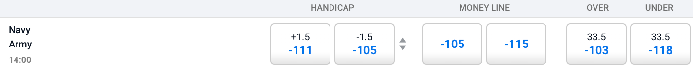
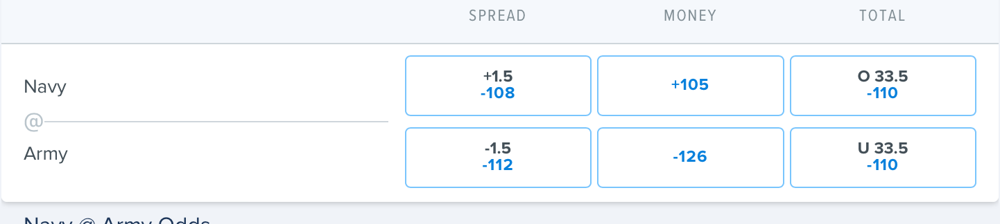

```{r setup, include=FALSE}
knitr::opts_chunk$set(echo = TRUE)
library(dplyr)
library(tidymodels)
library(tidyverse)
library(glmnet)
library(probably)
library(ggplot2)
library(sf)
library(maps)
library(plotly)
```


## Introduction

In this project, we will analyze if it is possible to make money sports gambling by exploiting the differences in odds offered by different sports betting companies, or **sportsbooks**, on the same game. We were motivated to explore this idea of "odds shopping" after meeting with Alex Monahan, co-founder of [OddsJam.com](oddsjam.com). Founded in 2021, OddsJam provides real-time odds comparisons of more than 100 books to their subscribers. They sell the idea that it is possible to make money gambling on sports. The idea boils down to viewing the discrepancy in odds offered by different sports books as an inefficient financial market which can easily be exploited. Countless user testimonials, including Alex Monahan, himself, claiming to have made $400,000 off his methods, appear all over the website, showing us that the company is at least good at marketing. However, the claim that it is possible to make money in the long run with gambling sounds too good to be true. We look to explore this claim in the following project.

## What is Sports Betting?

If a game is being played, people are going to bet on it. Humans have been gambling on sports since ancient times, but recent legislation in the United States has allowed sports betting to become legal in 30 states, launching it into the mainstream. Over $57.2 billion dollars were bet on U.S. licensed sportsbooks in 2021, and that does not take into account offshore websites used by those living in states where sports betting is not yet legal. 

```{r eval=FALSE, message=FALSE, include=FALSE}
library(albersusa)

us <- usa_composite()
us_map <- fortify(us, region="name")

legality = read.csv("legality_by_state.csv")
legality = legality %>%
  mutate(id = State,
         In.Person = ifelse(as.logical(Online) & as.logical(In.Person), 0, In.Person),
         not_legal = if_else(Online == 0 & In.Person == 0 & Pending == 0, 1, 0),
         ID = tolower(State),
         status = (Online + 2 * In.Person + 3 * Pending + 4 * not_legal),
         `Legal Status` = cut(status, breaks = c(0,1,2,3,4), labels = c("Online", "In Person Only", "Pending", "Not Legal")))


us_map = left_join(us_map, legality, by = "id")

us_map_betting = ggplot() +
  geom_map(data=us_map, map=us_map,
           aes(x=long, y=lat, map_id=id, fill = `Legal Status`),
           color = "white") + 
  ggthemes::theme_map() + 
  labs(title = "Sports Betting Legality By State")
  

save(us_map_betting, file = "graphics/us_map_betting")
```

```{r include=FALSE}
load("graphics/us_map_betting")
```

```{r echo=FALSE}
plot(us_map_betting)
```


With this rise in popularity has come a rise in data and analysis. Everywhere you look in the online gambling world there are people trying to sell their picks, claiming that they have an algorithm that can beat the **lines** (betting odds) set by Vegas. But the books know what they're doing. 

```{r eval=FALSE, message=FALSE, include=FALSE}
nba_raw = load_league("nba", TRUE)

nba_times = nba_raw %>% 
  select(c(id, start_time)) %>% 
  unique()
nba_times = nba_times %>% unique()
rm(nba_raw)

ncaab_raw = load_league("ncaab", TRUE)

ncaab_times = ncaab_raw %>% 
  select(c(id, start_time)) %>% 
  unique()
rm(ncaab_raw)

nhl_raw = load_league("nhl", TRUE)
nhl_times = nhl_raw %>%
  select(c(id, start_time)) %>%
  unique()
rm(nhl_raw)

nfl_raw = load_league("nfl", TRUE)
nfl_times = nfl_raw %>%
  select(c(id, start_time)) %>%
  unique()
rm(nfl_raw)

mlb_raw = load_league("mlb", TRUE)
mlb_times = mlb_raw %>%
  select(c(id, start_time)) %>%
  unique()
rm(mlb_raw)

ncaaf_raw = load_league("ncaaf", TRUE) 
ncaaf_times = ncaaf_raw %>%
  select(c(id, start_time)) %>%
  unique()
rm(ncaaf_raw)

times = rbind(nhl_times, nba_times, ncaab_times, ncaaf_times, nfl_times, mlb_times)
save(times, file = "betting_data/game_times.rdata")

all_sports_raw = rbind(mlb_ml, nba_ml, ncaab_ml, nfl_ml, ncaaf_ml, nhl_ml)

all_sports_reliability_plot = all_sports_ml %>%
  group_by(league) %>%
  mutate(bins = cut_number(home_prob_fair, 5)) %>%
  ungroup() %>%
  group_by(league, bins) %>%
  summarise(x = mean(home_prob_fair), 
            y = mean(home_team_win)) %>%
  ggplot(aes(x=x, y=y, color=league)) +
  geom_abline(slope = 1, color = "black", lty = 2) +
  geom_point() +
  geom_line() +
  facet_wrap(~league) +
  theme_bw() +
  labs(title = "Predicted Home Win Probability Vs. True Win Probability", x = "Predicted Win Probability", y = "True Home Win Probability")

save(all_sports_reliability_plot, file = "graphics/all_sports_reliability_plot")

rm(nba_raw, ncaab_raw, nhl_raw, nfl_raw, mlb_raw, ncaaf_raw, all_sports_raw)
```

```{r echo=FALSE}
load("graphics/all_sports_reliability_plot")
```

```{r echo=FALSE}
plot(all_sports_reliability_plot)
```


The graphic above displays a reliability plot for the last 5 full seasons of the MLB, NBA, NCAA Basketball, NCAA Football, NFL, and NHL. The plots display the cumulative frequency of true wins on the y axis, and the average predicted win probabilities on the x axis. Reliability plots indicate how well calibrated predictions made by a model are. The reliability plot of a perfectly calibrated model, meaning a prediction with probability $p$ is correct $p * 100$ percent of the time, will be linear with slope equal to 1. Each plot is almost a straight line, with slight variations, which indicates how incredible sportsbooks are at predict the outcomes.

Most gamblers bet for fun. These are known as "square bettors". They make up the overwhelming majority of bettors and view gambling as a form of entertainment. Most "squares" do not expect to be making money in the long run, and accept the fact that "the house always wins." On the other hand, there is a small subset of the gambling population known as "sharp bettors". These are analytically and data-driven bettors who only bet when they believe they have an edge over the books. One of the common ways that "sharps" gain the perceived edge is by creating their own model to predict win probabilities or other similar outcomes (total points scored, total yards gained, etc.) which they believe are more accurate than what the books predict. This however, is incredibly difficult, and requires an deeply advanced understanding of statistics. Because of the amount of money being gambled daily, books employ incredibly intelligent statisticians to create the prediction models. To beat the books in this way requires beating a team of highly paid, educated, and intelligent data scientists which is impractical.

However, there are other ways that people claim can be profitable in the long run, which we will explore in this project. But before we get any deeper into our analysis, we should go over how sports betting actually works, and introduce some common terminology.

## How Sports Betting Works

### Types of Bets

Sports books offer many different ways to bet on sports, but typically the most common types of bets are **straight**, **money line** bets, and **over/under** bets. Straight bets refer to betting on a team to win or lose by a certain amount of points, known as the spread. A money line bet means the gambler picks a team to win straight up. An over / under bet is when a bettor gambles on the combined score being above or below a certain number. For each of these bets, the book sets a probability in the form of a **line**. In the United States the probabilities are displayed through **American odds**, which come in the form of a number greater than or equal to 100, or less than or equal to -100. Positive values indicate that if a bettor bets $100, they will win the amount of the line plus their original bet. Negative values mean that a bettor has to bet the size of the line to win \$100 plus their original bet. 

<center>


</center>

Take this image, for example. It is a screen shot of an offering from one of the most used books in the U.S., DraftKings.com. It is for a college football game taking place on Saturday, December 10, 2022 between Navy and Army. The money line column is the easiest to understand. A $100 bet on Navy to win at +100 American odds would return \$100 in winnings plus the original \$100 bet, so \$200 in total. A \$120 bet on Army to win at -120 American odds would also win \$100, and return the orignal bet for a total of \$220. 

After understanding how American odds work, the other two columns are pretty straightforward. When betting on the spread, a positive value means that a bet on that team will push (get just the bet back) if the team loses by the spread and win if the team loses by less than the spread. Conversely, a negative value means that a team has to win by more than the spread to win the bet. DraftKings thinks that Army is a 1 point favorite and is offering a line of -110. This means a bet of $110 would win \$100 if Army wins by more than 1. If they win by 1, the original bet will be returned. Similarly, a bet on the Total over (indicated by O 33.5 in the picture) means the bettor will win if the sum of the points scored by both teams is 34 or more (the .5 means that the bet cannot push), and a bet on the under means the bettor will win if the sum of the points is 33 or less.

### How Books Make Money

Books make their profit by increasing the probabilities of each bet, which is reflected in the lines, so that the sum of possible outcomes is greater than 1. Each line has an **implied probability** which is calculated using the simple formula 

Implied Probability : $\frac{-1 * \text{Negative American Odds}}{\text{-1 * Negatvie American Odds + 100}}$ or $\frac{100}{\text{ Positive American Odds + 100}}$.

DraftKings sets the two spreads at -110, which has an implied probability of 

$\frac{110}{110 + 100} = .5238$.

The sum of these two probabilities is 1.0476. The extra .0476 is known **juice** or the **vig**, and explains how books profit. If Bettor A places a $110 bet on Navy at +1 and Bettor B places \$110 on Army -1, and Army wins by more than 1, DraftKings will pay \$100 to Bettor B, but collect \$110 from Bettor A, leaving the book with a \$10, or 4.76%, profit. This motivates DraftKings to try and keep equal money on both Army and Navy. The same principles apply to the odds set for moneyline and over/under bets across all books, though the amount of vig may vary.

### Removing the Vig

Removing the vig is important to our research in order to be able to identify the true underlying win probability set by each book. To do this, we divide each implied probability by the sums of the implied probabilities. This normalizes the probabilities by removing the vig proportionally from each line. The resulting **fair probabilities** should add up to 1.

Fair Probability : $\text{Fair Probability}_1 =\frac{\text{implied probability}_1}{\text{implied probability}_1 + \text{implied probability}_2}$

Using the DraftKings moneyline odds, we calculate the two implied probabilities ($p_n$ for navy, $p_a$ for army):

$$p_n = \frac{100}{100 + 100}=.5 \\
p_a = \frac{120}{120 + 100}=.545$$

The fair odds, given by $f_n$ and $f_a$, can then be calculated:

$$f_n = \frac{p_n}{p_n+p_a} = \frac{.5}{1.045} = 0.478\\
f_a = \frac{p_a}{p_n+p_a} = \frac{.545}{1.045} = .522$$

Using our method of removing the vig, we believe DraftKings set the win probability of Navy to be .478, and the win probability of Navy to be .522.

## Different Books Can Have Different Lines

Lines on a given book are constantly changing due to the fact that they are trying to keep enough money on both sides of the bet. This means having equal amount of money on the home and away spread and over under, or enough money on each team's money line based on the implied probability of the line. In addition, it is possible that different books may set different lines when the odds are first offered due to a difference in the way they calculate their predictions. 


<center>



</center>

<center>



</center>

Staying with the same game, but looking at two different books, Pinnacle and FanDuel respectively, illustrates differnet lines between books. DraftKings sets the money line at +100 / -120, but Pinnacle sets the money line at -105 / -115 and FanDuel at +105 / -126.

Different books setting different lines for the same outcome can lead to an interesting opportunity to possibly make money in the long run by exploiting these different lines.

## Expected Value Betting

Let's consider the money line set by Pinnacle. Pinnacle is regarded by professionals as the "Sharpest Book" due to their commitment to education on betting analysis to shift the mindset of a bettor from gambling to investing. The -105 line set for a Money Line bet has an implied probability of .512. The -115 line has an implied probability of .5348837. The fair odds have a .489 win probability for Navy, and a .511 win probability for Army. A bet of \$100 on Navy has an expected value of $.489 * 100 -.511 * 105 = -4.755$. In the long run, this bet will lose money, but what if we assumed that Pinnacle set the true win probability. Using Pinnacle's win probability, but betting on FanDuel leads to an expected value of $.489 * 105 - .511 * 100 = .245$. Although not much, assuming Pinnacle's win probability, we expect to make $.245 on a \$100 bet on FanDuel.

## Research Question

In the following analysis, we will explore if it is actually possible to be profitable using positive expected value betting by creating our own model for win probability by using the win probabilities set by the books and the performance of those win probabilities.

## Data Set

### Scraping the Data

Our data was scraped from [ActionNetwork's](actionnetwork.com) historical betting database. The company functions similarly to OddsJam, however they are used by gamblers to keep track of their bets. Meaning they are less inclined to keep their data private as they are not selling it to their customers.

We noticed that everytime a page on ActionNetwork with betting data was loaded, it would send an HTTP request with the url 
https://api.actionnetwork.com/web/v1/scoreboard/{league}?season={year}&week={week}&bookIds={list of book ids} for NFL and NCAA Football, and https://api.actionnetwork.com/web/v1/{league}?&date={YYYYDDMM}&bookIds={list of book ids} for NCAA Basketball, NBA, NHL, and MLB. This allowed us to easily scrape data using the `httr` and `jsonlite` packages by specifying which week and year for NFL and NCAAF, and the date for the other 4 leagues. The list of book ids was taken from https://api.actionnetwork.com/web/v1/books, which contained all the information about the books available and their corresponding IDs. We were able to get historical betting data across multiple different books from as far back as 2017. The code we wrote to scape the data can be found at [data_scraper.R](https://github.com/declanelias/comp456DeclanJoe/blob/main/expected_value/scripts/data_scraper.R).

To reproduce our scraped data, run the following code. To get the data without having to scrape the code, go to Load Clean Data section.

```{r, eval=FALSE, echo=TRUE}
source("scripts/data_scraper.R")

save_df = function(league) {
  books = "all"
  start_year = 2017
  end_year = 2022
  betting_df = get_betting_data(league, books, start_year, end_year)
  save(betting_df, file = paste("betting_data/", league, "_raw.rdata",sep = ""))
}

leagues = c("ncaaf", "nfl", "mlb", "nba", "ncaab", "nhl")

map(
  leagues,
  save_df
)
```

### Cleaning the Data

The most challenging part of the project was cleaning the data. As mentioned above, ActionNetwork does not make their money off of selling their data and analysis to their customers, so they have much less incentive to keep accurate and reliable data. We ran into a good amount of issues along the way with the accuracy of the data. There were multiple instances of odds for a game set by a given book being swapped, meaning that one book would have a similar away line compared to the home line for the same game from the other books. We also did not know the exact time the lines were recorded for each observation. This could potentially lead to drastic differences in lines between books if recorded at different times. 

To solve these problems, we swapped the lines if they were +-.2 of the value of the "consensus" of the home or away lines set by ActionNetwork (we were not able to figure out how exactly the company calculated consensus, but it is what the public money viewed the line as). Using the consensus value allowed us to know what the home and away lines should have roughly been. From their we did another check, and if the difference was still +- .2, we threw the data out. This allowed us to know that our data was at least not completely inaccurate. 

We then had the problem of having each version of a company in a given state being counted as their own book. For example, BetMGM in Arizona and BetMGM in Nevada each had their own observation, even though they offered the same exact line (or very similar). To solve this problem, we took the average of the observations of each company with multiple books. This work can be found at [book_average.R](https://github.com/declanelias/comp456DeclanJoe/blob/main/expected_value/scripts/book_average.R).

From there we selected the books that had over a certain amount of observations per year for the previous 5 full seasons (there was a wide array of total observations for each book within each league), and then threw out any game that did not have observations for every book. The code used to do this can be found at ()[].

To reproduce the clean code from the raw code scraped above, run the following.

```{r, eval=FALSE, echo=TRUE}
source("scripts/clean_data.R")
source("scripts/book_average.R")

nba_ml = clean_data("nba") %>% average_books("nba") %>% final_clean(2017, 2021, 500)
nhl_ml = clean_data("nhl") %>% average_books("nhl") %>% final_clean(2017, 2021, 900)
mlb_ml = clean_data("mlb") %>% average_books("mlb") %>% final_clean(2017, 2022, 500)
ncaab_ml = clean_data("ncaab") %>% average_books("ncaab") %>% final_clean(2017, 2021, 450)
ncaaf_ml = clean_data("ncaaf") %>% average_books("ncaaf") %>% final_clean(2018, 2022, 150)
nfl_ml = clean_data("nfl") %>% average_books("nfl") %>% final_clean(2017, 2021, 140)
```


### Load Clean Data

The code below loads the data used for the rest of the analysis.

```{r}
load_league = function(league, raw = FALSE) {
  if (raw) {
    suffix = "_raw.rdata"
  } else {
    suffix = "_ml_clean.rdata"
  }
  file = paste("betting_data/", league, suffix, sep = "")
  env = new.env()
  nm = load(file, env)
  return(env[[nm]])
}

nba_ml = load_league("nba")
ncaab_ml = load_league("ncaab")
nhl_ml = load_league("nhl")
nfl_ml = load_league("nfl")
mlb_ml = load_league("mlb") 
ncaaf_ml = load_league("ncaaf")

all_sports_ml = rbind(nba_ml, ncaab_ml, nhl_ml, nfl_ml, mlb_ml, ncaaf_ml)
```


## Book Analysis

The first step in answering our research question is to understand how different books perform. This help us decide how to fit a model using different book data, we use Brier Score which is a type of scoring rule, or, in other words, a metric designed to measure the accuracy of probabilistic forecasts. The Brier Score for each prediction is calculated by the function $(p_t - o_t)^2$ where $p_t$ is the predicted home win probability and $o_t$ is the outcome (1 if the home team won, 0 if they loss) at instance $t$. We then calculated the average Brier Score for each book for a given time period to give us a metirc to compare against. 

```{r echo=FALSE, message=FALSE, warning=FALSE}
all_sports_ml %>%
  group_by(league, parent_name) %>%
  filter(season != max(season)) %>% 
  mutate(league = toupper(league)) %>%
  summarise(brier_score = mean(brier_score)) %>%
  ungroup() %>%
  group_by(league) %>%
  mutate(brier_skill_score = brier_score) %>%
  ungroup() %>%
  ggplot(aes(x = brier_skill_score, color = league)) +
  geom_histogram(binwidth = .001) +
  facet_wrap(~league) + 
  theme_bw() +
  labs(x = "Brier Score", y = "Count", title = "Distribution of Books")

```

We notice with NHL, and to a lesser extent the MLB and NBA, that most books perform very similarly. With the NHL, all books perform practically the same. MLB and NBA offer a little more variation in performances, but are still have a majority grouped around the same brier score. NFL, NCAA Football (NCAAF), and NCAA Mens Basketball (NCAAB),  offer a little more variation than NBA and MLB. A singular outlier vastly outperforms the other books in the NFL. NCAAB and especially NCAAF, distribution. NCAAF clearly has the largest variation in book performance.

These distributions make sense given the nature of the different leagues. It would follow that leagues like the MLB, NBA, and NHL, which play significantly more games than the NFL, NCAAF, and NCAAB, would be easier to predict. As there is less variation in the outcome game to game and vastly more data. It also follows that NCAAB and NCAAF would be difficult to predict due to the lower amount of games, and the significant decrease in talent across the teams leading to more variation in the outcomes.

We now know how the books perform overall, but we still want to see if there is any year to year variation in the performance of the books. We are interested to find out that if a book performs well in one year, is that random chance, or is the given book actually better at making predictions than the other books. 

```{r echo=FALSE, message=FALSE, warning=FALSE}
create_bs_by_year_plot = function(league_ml, league) {
  league_ml %>%
    filter(season != max(season)) %>%
    group_by(league, parent_name, season) %>% 
    mutate(league = toupper(league)) %>%
    summarise(brier_score = mean(brier_score)) %>%
    mutate(`Parent Name` = parent_name) %>%
    ggplot(aes(x = season, y = brier_score, color = `Parent Name`)) +
    geom_line() +
    geom_point() +
    theme_bw() + 
    labs(x = "Season", 
         y = "Brier Score",
         title = league)
}

create_bs_by_year_plot(ncaaf_ml, "NCAAF")
create_bs_by_year_plot(nfl_ml, "NFL")
create_bs_by_year_plot(nba_ml, "NBA")
create_bs_by_year_plot(ncaab_ml, "NCAAB")
create_bs_by_year_plot(nhl_ml, "NHL")
create_bs_by_year_plot(mlb_ml, "MLB")
```

The plots paint an interesting picture of how books perform each year. Generally, books perform very similar each year, with not much difference between the best and worst performing group. Similar to the previous graphic, we see a wider spread for the college sports. We also do not see any trend in performance across the leagues. NCAAF performs way better in 2020 and 2021 than it did in 2018 and 2019, whereas NCAAB follows an opposite trend.  NBA performs worse each year. In the NBA, the books performed considerably worse in 2020 than they did in the other years, but in the NHL, the books perform significantly better in 2020. We suspect this may be due to COVID affecting the different leagues. MLB performs consistently all 4 years. An interesting thing to note is that in 2020, NCAAF, NFL, and MLB all have a significant outlier with Jazz Sportsbook performing significantly better in each league.


## Fitting The Models

To find the best model for the data, we set the training period as the first 4 seasons in our data set, leaving the last full season to run our betting algorithm on. We calculated simple averages of the predicted probabilities of all the books, the books that performed above average in the period, and combinations of each of the top performing books. We then did the same with an average weighed by the inverse of the brier score for the time period. We then fit logistic regression models to the same amount of books as the averages. And finally we fit a lasso and ridge regression models. For the regression models we calculated the brier score on cross validated test sets and then averaged across each fold. 

Although for some leagues a logistic regression model performed better than the averages, we chose to go with either an average or weighted average for the sake of simplicity. The difference in performance of the top performing logistic model vs. the top performing average model was negligible. There was also some data leakage in our regression models that we could not figure out that was leading to incredibly unrealistic performance on the testing set (This is cheating a little because we applied our betting algorithm to the probabilities predicted by the regression models for the last full season. There is a possibility, however, that we are simply geniuses and have found a way to make upwards of $600,000 from a starting bankroll of \$100 betting on college football).

<details>
  <summary>Click for Model Fitting</summary>
  
Code for fitting the models can be found at [models.R](https://github.com/declanelias/comp456DeclanJoe/blob/main/expected_value/scripts/models.R)

```{r}
get_model_brier_score = function(model_name, n_above_average) {
  if (model_name %in% c("lasso", "ridge")) {
    lasso = model_name == "lasso"
    return(fit_reg_log_model(lasso)$metrics %>% filter(metric == "brier_score"))
  } else {
    model_func = switch (model_name,
                         "weighted average" = function(n) { fit_top_n_books_model(n, TRUE) },
                         "average" = function(n) { fit_top_n_books_model(n, FALSE) },
                         "logistic" = fit_logistic_model)
    vec = c()
    for (n in c("all", "above average")) {
      vec = rbind(vec, model_func(n)$metrics %>%
                    filter(metric == "brier_score"))
    }
    for (n in c(n_above_average:1)) {
      vec = rbind(vec, model_func(n)$metrics %>%
                    filter(metric == "brier_score"))
    }
    
    return(vec)
  }
}

fit_all_models = function() {
  n_above_average = fit_top_n_books_model("above average", FALSE) %>% length()
  brier_vec = c()
  for (model in c("lasso", "ridge", "weighted average", "average", "logistic")) {
    brier_vec = rbind(brier_vec, get_model_brier_score(model, n_above_average))
  }
  return(brier_vec %>% unique() %>%
           arrange(value))
}
```


### NCAAF

#### Fit all models
```{r warning=FALSE}
source("scripts/models.R")
constructor(ncaaf_ml %>% 
              filter(book_id != 13) %>% 
              group_by(id) %>% 
              filter(max(home_prob_vig) - min(home_prob_vig) < .05,
                     max(away_prob_vig) - min(away_prob_vig) < .05), 
            2022)

fit_all_models()
```

#### Fit To Training and Test Data

```{r warning=FALSE}
training_ncaaf = fit_top_n_books_model(1, FALSE, FALSE)$`Average of Top 1 Books`
average_ncaaf = fit_top_n_books_model("all", FALSE, FALSE)$`Average of Top 13 Books`$.pred_TRUE
final_fit_ncaaf = fit_top_n_books_model(1, FALSE, TRUE)$`Average of Top 1 Books`
```

### NFL

#### Fit all models
```{r warning=FALSE}
source("scripts/models.R")
constructor(nfl_ml %>%
              filter(book_id != 13) %>%
              group_by(id) %>% 
              filter(max(home_prob_vig) - min(home_prob_vig) < .05,
                     max(away_prob_vig) - min(away_prob_vig) < .05), 2021)
fit_all_models()
```

#### Fit To Training and Test Data

```{r warning=FALSE}
training_nfl = fit_top_n_books_model(4, FALSE, FALSE)$`Average of Top 4 Books`
average_nfl = fit_top_n_books_model("all", FALSE, FALSE)$`Average of Top 17 Books`$.pred_TRUE
final_fit_nfl = fit_top_n_books_model(4, FALSE, TRUE)$`Average of Top 4 Books`
```

### NBA

#### Fit all models
```{r warning=FALSE}
source("scripts/models.R")
constructor(nba_ml %>%
              filter(book_id != 13) %>%
              group_by(id) %>% 
              filter(max(home_prob_vig) - min(home_prob_vig) < .05,
                     max(away_prob_vig) - min(away_prob_vig) < .05), 2021)
fit_all_models()
```

#### Fit To Training and Test Data
```{r warning=FALSE}
training_nba = fit_top_n_books_model(4, FALSE, FALSE)$`Average of Top 4 Books`
average_nba = fit_top_n_books_model("all", FALSE, FALSE)$`Average of Top 22 Books`$.pred_TRUE
final_fit_nba = fit_top_n_books_model(4, FALSE, TRUE)$`Average of Top 4 Books`
```


### NCAAB

#### Fit all models

```{r}
source("scripts/models.R")
constructor(ncaab_ml %>%
              filter(book_id != 13) %>%
              group_by(id) %>% 
              filter(max(home_prob_vig) - min(home_prob_vig) < .05,
                     max(away_prob_vig) - min(away_prob_vig) < .05), 
            2021)
fit_all_models()
```

#### Fit to Training and Test Data

```{r warning=FALSE}
training_ncaab = fit_top_n_books_model(4, FALSE, FALSE)$`Average of Top 4 Books`
average_ncaab = fit_top_n_books_model("all", FALSE, FALSE)$`Average of Top 11 Books`$.pred_TRUE
final_fit_ncaab = fit_top_n_books_model(4, FALSE, TRUE)$`Average of Top 4 Books`
```


### NHL

#### Fit all models

```{r warning=FALSE}
source("scripts/models.R")
constructor(nhl_ml, 2021)
fit_all_models()
```

#### Fit to Training and Test Data

```{r}
training_nhl = fit_top_n_books_model(1, FALSE, FALSE)$`Average of Top 1 Books`
average_nhl = fit_top_n_books_model("all", FALSE, FALSE)$`Average of Top 14 Books`$.pred_TRUE
final_fit_nhl = fit_top_n_books_model(1, FALSE, TRUE)$`Average of Top 1 Books`
```


### MLB

```{r warning=FALSE}
source("scripts/models.R")
constructor(mlb_ml %>% 
              filter(book_id != 13) %>%
              group_by(id) %>% 
              filter(max(home_prob_vig) - min(home_prob_vig) < .05,
                     max(away_prob_vig) - min(away_prob_vig) < .05), 
            2021)
fit_all_models()
```

```{r warning=FALSE}
training_mlb = fit_top_n_books_model(4, TRUE, FALSE)$`Weighted Average of Top 4 Books`
average_mlb = fit_top_n_books_model("all", FALSE, FALSE)$`Average of Top 14 Books`$.pred_TRUE
final_fit_mlb = fit_top_n_books_model(4, TRUE, TRUE)$`Weighted Average of Top 4 Books`
```


</details> 
### Visualizations

This plot indicates how calibrated each model is to the training data.

```{r include=FALSE}
get_model_reliability_data = function(train_fit, average, mod_league, mod_name) {
  
  train_fit$average_win_prob = average
  
  bin_train = cut_number(train_fit$.pred_TRUE, 5)
  model_prob_bin = train_fit
  model_prob_bin$bin = bin_train
  
  model_prob_bin = model_prob_bin %>%
    group_by(bin) %>%
    summarise(x = mean(.pred_TRUE), 
              y = mean(as.logical(home_team_win)),
              model = mod_name,
              league = mod_league) %>%
    select(c(x, y, model, league))
  
  return (model_prob_bin)
}
```

```{r echo=FALSE}
ncaaf_reliability = get_model_reliability_data(training_ncaaf, average_ncaaf, "NCAAF", "Top Book")
nfl_reliability = get_model_reliability_data(training_nfl, average_nfl, "NFL", "Average of Top 4 Books")
nba_reliability = get_model_reliability_data(training_nba, average_nba, "NBA", "Average of Top 4 Books")
ncaab_reliability = get_model_reliability_data(training_ncaab, average_ncaab, "NCAAB", "Average of Top 4 Books")
nhl_reliability = get_model_reliability_data(training_nhl, average_nhl, "NHL", "Top Book")
mlb_reliability = get_model_reliability_data(training_mlb, average_mlb, "MLB", "Weighted Average of Top 4 Books")

rbind(ncaaf_reliability, nfl_reliability, nba_reliability,
      ncaab_reliability, nhl_reliability, mlb_reliability)  %>%
  mutate(Model = model) %>%
  ggplot(aes(x=x, y=y, color = league)) +
  geom_abline(slope = 1, color = "black", lty = 2) +
  geom_point() +
  geom_line() +
  facet_wrap(~league) +
  theme_bw() +
  labs(title = "Predicted Home Win Probability Vs. True Win Probability", x = "Predicted Win Probability", y = "True Home Win Probability")
```

The reliability plots of each selected model show that the models are generally well calibrated. NCAAF and NCAAB tend to underestimate slightly as the true home win probability is greater than the predicted win probability. NFL appears to overestimate until about .6 true win probability then slightly underestimate. NBA, MLB, and the NHL appear to be very well calibrated, however this is not surprising because of the nature of the leagues.

## Expected Value

<details>
  <summary>Click for Betting Method</summary>

```{r}
load("betting_data/game_times.rdata")

calc_winnings = function(ml, stake) {
  if_else(ml > 0,
          stake * ml / 100,
          stake / (-1 * ml) * 100)
}

calculate_ev = function(final_fit, league_ml) {
  league_ml = league_ml %>% filter(season == max(season))
  final_fit = left_join(
    league_ml %>%
      filter(season == max(season)),
    final_fit %>%
      select(id, .pred_TRUE),
    by = "id"
  )
  
  return(
    final_fit %>%
      mutate(ev_home = (calc_winnings(ml_home, 100) * .pred_TRUE) - (100 * (1 - .pred_TRUE)),
             ev_away = calc_winnings(ml_away, 100) * (1 - .pred_TRUE) - 100 * .pred_TRUE)
  )
}

books = c("BetOnline", "Bovada")

bet = function(final_fit, league_ml, ev_thresh = 0.1) {
  
  ev_df = calculate_ev(final_fit, league_ml)
  
  ev_df = ev_df %>% filter(parent_name %in% books)
  
  ev_df = ev_df %>%
    mutate(ev = if_else(ev_home > ev_away, ev_home ,ev_away),
           ml = if_else(ev == ev_home, ml_home, ml_away),
           team_win = if_else(ev_home > ev_away, home_team_win, !home_team_win),
           win_prob = if_else(ev_home > ev_away, .pred_TRUE, 1 - .pred_TRUE)) %>%
    group_by(id) %>%
    filter(ev == max(ev))
  
  ev_df = ev_df %>%
    filter(ev > ev_thresh)
  
  ev_df = left_join(ev_df, times, by = "id") %>%
    mutate(start_time = strftime(start_time, format="%Y-%m-%d")) %>%
    select(id, ev, ml, start_time, team_win, win_prob)
  
  ev_df = ev_df %>%
    arrange(start_time)
  
  ev_df = ev_df %>%
    mutate(odds = if_else(ml > 0,
                          1 + ml / 100,
                          1 - 100 / ml),
           bet_perc = ((odds-1) * win_prob - (1 - win_prob)) / (odds-1))
  
  ev_df = ev_df %>%
    group_by(start_time) %>%
    mutate(bet_perc_sum = sum(bet_perc)) %>%
    mutate(bet_perc = if_else(bet_perc_sum > 1, bet_perc / bet_perc_sum, bet_perc))
  
  ev_df = ev_df %>%
    mutate(stake = bet_perc * 100,
           return = if_else(team_win, calc_winnings(ml, stake) + stake, -stake))
  
  ev_df = ev_df %>%
    group_by(start_time) %>%
    summarise(return = sum(return) / 100 + 1,
              num_bets = n())
  
  return(ev_df)
}

calc_bankroll = function(final_fit, league_ml, initial_bankroll) {
  bets = bet(final_fit, league_ml)
  return = bets$return
  
  bankroll_vec = c(initial_bankroll, 1:length(return))
  bankroll = initial_bankroll
  for (i in 1:length(return)) {
    bankroll_vec[i + 1] = bankroll_vec[i] * return[i]
  }
  
  return(cbind(bankroll_vec, c(0,bets$num_bets)))
}
```

</details>

Now that we have our predicted probabilities, we can see if we can use expected value to be profitable. We first calculate the expected value for each line for each observation. This gives us the home and away expected values for each book for each game. We then select the highest expected value for each game. 

```{r echo=FALSE, message=FALSE, warning=FALSE}
final_fits = list(final_fit_ncaaf, final_fit_nfl, final_fit_ncaab, final_fit_nba, final_fit_mlb, final_fit_nhl)
league_mls = list(ncaaf_ml, nfl_ml, ncaab_ml, nba_ml, mlb_ml, nhl_ml)
leagues = c("NCAAF", "NFL", "NCAAB", "NBA", "MLB", "NHL")

ev_df = NULL
for (i in 1:6) {
  ev_df = rbind(ev_df, calculate_ev(final_fits[[i]], league_mls[[i]]) %>% mutate(league = leagues[i]))
}

ev_df %>%
  mutate(ev = if_else(ev_home > ev_away, ev_home ,ev_away),
         win_prob = if_else(ev_home > ev_away, .pred_TRUE, 1 - .pred_TRUE)) %>%
  filter(ev > 0) %>%
  select(c(ev, win_prob, league)) %>%
  mutate(bin = cut_number(win_prob, 5)) %>%
  group_by(bin, league) %>%
  summarise(ev = mean(ev)) %>%
  ggplot(aes(x = bin,y = ev)) +
  geom_line() +
  geom_point() + 
  facet_wrap(~league) +
  theme_bw() +
  theme(axis.text.x = element_text(angle = 90, vjust = 0.5, hjust=1)) +
  labs(x = "Predicted Win Probability", y = "Expected Value", title = "Expected Value Vs. Predicted Win Probability By League")
  
```

Plotting the expected value vs the predicted win probability, we notice a very interesting trend across each league. The lowest predicted win probability group has the highest average expected value for each league. This indicates that there is more value betting on underdogs with low predicted win probabilities. We expect the betting method to place a lot of bets on heavy underdogs. 

## Betting Method

From here we can choose which games to bet on. We go day by day with our bets, starting with the earliest days. We calculate bet size each day using the Kelly Criterion, a formula derived by J.L. Kelly Jr. to determine the optimal theoretical percentage of bankroll to bet. 

Kelly Criterion = $\frac{bp-q}{b}$ where $b$ is the decimal odds of the money line given by $\frac{l}{100}$ if money line $l$ is positive or $\frac{100}{-l}$ is $l$ is negative.

If the sum of the Kelly Criterion for games that day are over 1, we divide each bet by the sum of Kelly Criterion to allow us to bet 100% of the bankroll (this is an incredibly aggressive and risky method. Future work could be done to decide the optimal way to bet). We then place our bets, if the bet won, the profit and bet sized are returned to the bankroll. If the bet lost, the bet size is subtracted from the bankroll. We calculate profit overall for the day, add it to the bankroll, and move on to the next day.

## Results

```{r warning=FALSE}
league_bets = NULL
for (i in 1:6) {
  bets = as.data.frame(calc_bankroll(final_fits[[i]], league_mls[[i]], 100)) %>%
    mutate(league = leagues[i],
           day = 1:nrow(.) - 1)
  league_bets = rbind(league_bets, bets)
}


bankroll_plot = function(plot_league) {
  
  total_bets = league_bets %>% filter(plot_league == league) %>% summarise(sum(V2))
  
  league_bets %>%
    filter(plot_league == league) %>%
    ggplot(aes(x = day, y = bankroll_vec)) +
    geom_line() +
    theme_bw() +
    labs(x = "Days", y = "Bankroll ($)", title = paste("Bankroll over time for", plot_league, "with", total_bets, "bets"))
}

for(i in leagues) {
  p = bankroll_plot(i)
  plot(p)
}
```

Using our method, each league was profitable besides the NBA. Betting on NBA resulted in a loss of $10 with the method. Betting on a total of 36 bets over the course of the season. NFL and NCAAB both returned small profits, with the NBA returning a profit of just under \$5 on 18 bets, and NCAAB returning a profit of just under \$5 on 58 bets. NCAAB, however was negative for a majority of the season, hovering around \$97.50 until having 1 really good day near the end of the season. The NFL performed very well, returning a profit of just over \$20 on 13 bets. However, MLB and NHL are where the real money rolls in. Over 165 bets, the MLB returned a profit of \$80, and the NHL returned a profit of just over \$50 on 241 bets. 

Overall starting with $600, our method returned a profit of \$168.53, or 28.1%. This is an incredible performance over each league. If we assume the validity of the data, then we can conclude that expected value betting is profitable in the long run. Sadly, we do not have much faith that our data is accurate enough to come to a concrete conclusion.

## Open Questions

As mentioned throughout the project, one of the big limitations was the accuracy of the data. We do not believe our data is accurate enough to be able to say for certain that expected value betting is profitable. Our findings do, however, motivate us to collect accurate data and revisit the work we have done in this paper. 

We also found that using a logistic models to fit to the test season and applying the betting algorithm resulted in impossible profits (in the hundreds of thousands to millions). This indicates to us that there was some data leakage somewhere, however we could not find it even after extensive debugging. 
